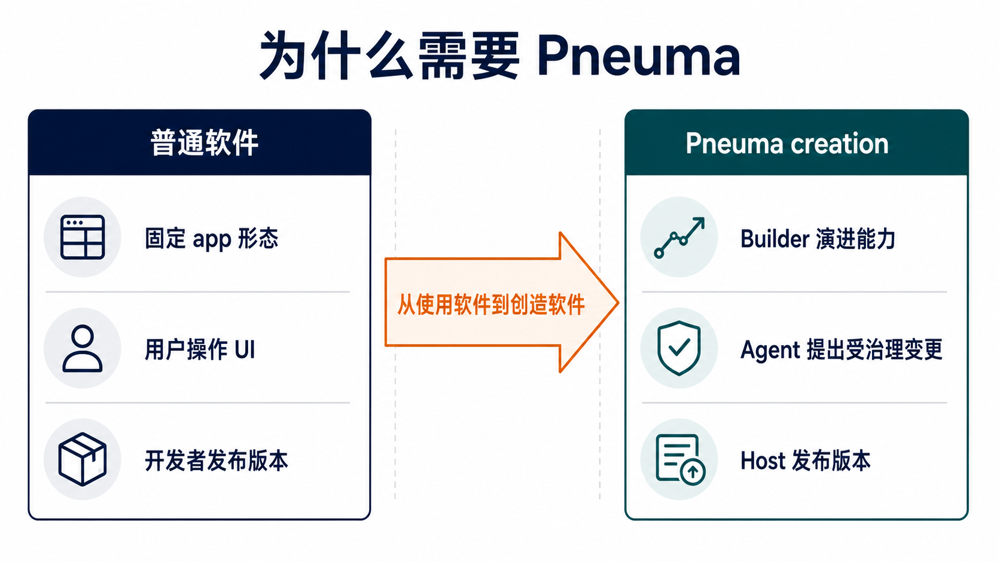
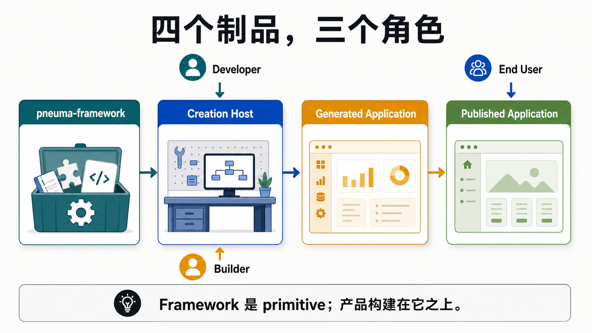
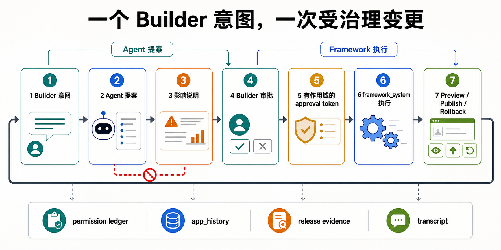
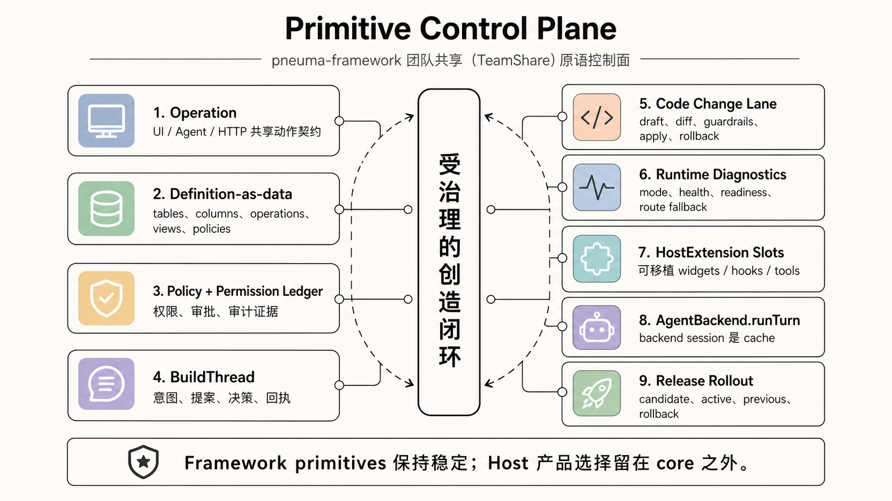
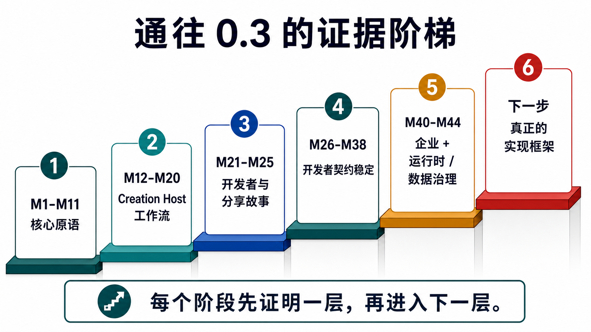
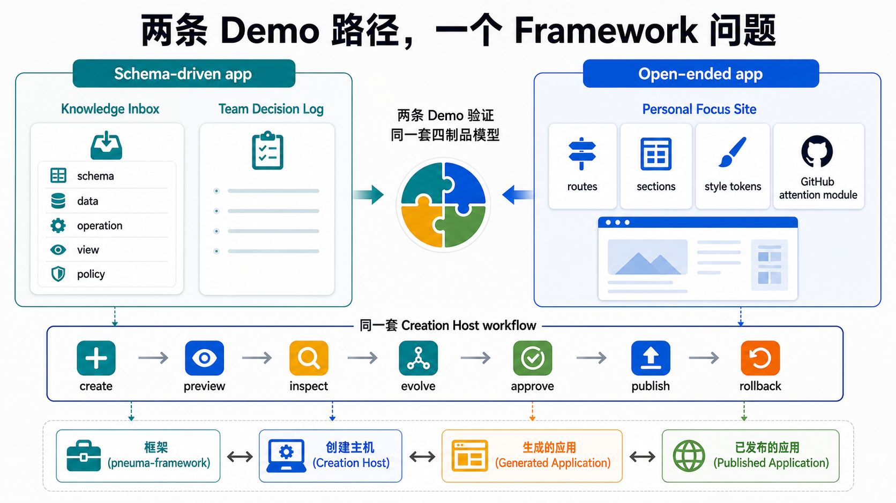
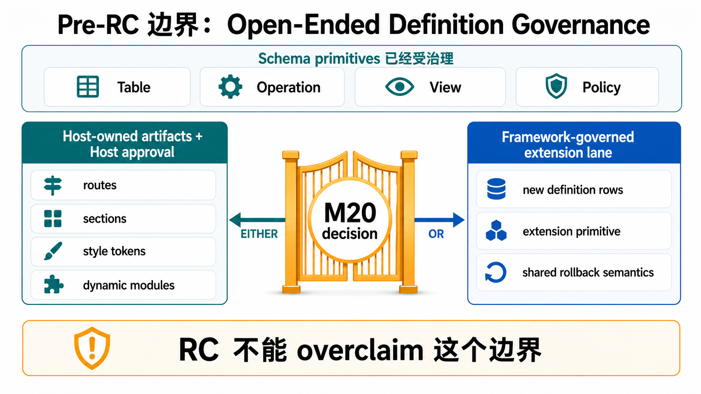

# Pneuma 团队分享包

**日期：** 2026-05-04
**状态：** M20 阶段历史分享包；当前 RC 入口已由 [从这里开始](../developer/start-here.zh-CN.md) 和 [Release Candidate Snapshot 中文版](./release-candidate-snapshot.zh-CN.md) 取代
**受众：** 了解普通软件产品、但没有 Pneuma 背景的团队成员
**形式：** 45-60 分钟团队分享，包含两个可选本地浏览器 demo
**English version:** [Pneuma Team Share Package](./team-share-demo.md)

这是 M20 之后的 canonical 团队分享包。它仍然适合理解 pre-RC 推理路径，但不再是 Developer 的第一入口。当前 Developer 入口请读 [从这里开始：构建 Creation Host](../developer/start-here.zh-CN.md)，当前 RC 决策证据请读 [Release Candidate Snapshot 中文版](./release-candidate-snapshot.zh-CN.md)。

它替代旧的 M2 治理专项 runbook，用从顶层到细节的方式解释：

```text
项目目标
  -> 产品 / 制品模型
  -> framework 架构
  -> 当前实现证据
  -> 可运行 demo
  -> 当前 RC decision 边界
```

## 目标

分享结束后，团队应该能说清楚：

```text
Pneuma 是构建 AI-native Creation Host 的基础设施。
Developer 用 framework 构建 Host。
Builder 在 Host 里通过和 Build-phase Agent 对话，创建、检查、演进、审批、发布、监控、回滚 Generated Application。
End User 使用 Published Application。
```

第二句要记住的是：

```text
Pneuma 不是在证明 agent 能编辑文件。
Pneuma 在证明 app evolution 可以成为一个受治理的软件 primitive。
```

## 1. 为什么需要这个项目

绝大多数软件默认 Developer 在用户进入前就完成了 app 的形状。用户只是操作一个已经完成的软件表面：点按钮、填表、看 dashboard。

Pneuma 测试的是另一个 contract：

```text
Builder 可以在 session 中通过和 Agent 对话，改变 app 自己的行为、数据模型、UI 表面和发布状态。
```



关键区别是：

| 普通 app 交互 | Pneuma creation 交互 |
|---|---|
| 添加一条数据 | 添加一个新的 capability |
| 过滤一个列表 | 创建新的 View 和 Operation |
| 问 assistant 怎么做 | 让 Agent 在治理路径里演进 app |
| 发布 Developer 做出的 build | 发布 Host workflow 中产生的 Generated Application version |

这解释了为什么项目需要 Operation、definition-as-data、approval token、app history、permission ledger、rollout state 和 rollback。 如果只是生成一个 hard-coded app，这些 primitive 都会显得过重。

## 2. 四制品模型

最常见的误解，是把所有东西都叫成一个 "pneuma app"。当前模型刻意把四个制品分开：



| 制品 | 含义 |
|---|---|
| **pneuma-framework** | 提供 primitive、semantic tools、wire protocol、lifecycle、governance、release evidence 的 library/runtime。 |
| **Creation Host** | Developer 构建出来的 Builder-facing 产品表面，Builder 在这里创建和操作 Generated Application。 |
| **Generated Application** | 通过 Host 创建出来的 app instance。它拥有 definition、data、versions、runtime surface 和 release history。 |
| **Published Application** | 被选中并暴露给 End User 的某个 Generated Application version。 |

角色关系：

| 角色 | 主要职责 |
|---|---|
| **Developer** | 构建或配置 Creation Host、stack profiles、Host UX 和领域约束。 |
| **Builder** | 在 Creation Host 里通过对话、preview、inspection、approval、publish 塑造 Generated Application。 |
| **End User** | 像使用普通 app 一样使用 Published Application。他们可能完全看不到 Build-phase Agent。 |

分享时可以用这句话：

> Framework 是 primitive。Creation Host 和 generated apps 是构建在它之上的产品。

## 3. 受治理的 Creation Loop

核心循环是：一个 Builder 意图，变成一次受治理的 app change。



这条 loop 解释了为什么 M2 和 M7 重要：

```text
Builder intent
  -> Agent proposal
  -> impact disclosure
  -> Builder approval
  -> scoped approval token
  -> framework_system execution
  -> app definition / release state changes
  -> preview、publish、rollback 和 evidence
```

权力分离是不可妥协的：

| Actor | 能做什么 |
|---|---|
| Build-phase Agent | 通过 framework semantic tools 提出 changes。 |
| Builder | approve 或 deny proposal。 |
| framework_system | 消费 scoped approval authority 并执行 governed mutation。 |
| End User | 通过正常 app policy 使用 published app。 |

所以 approval evidence 不是 debug log，而是产品状态。未来企业级表面必须能回答：

```text
谁提出了这个变更？
谁批准了它？
到底批准了什么？
哪个 scoped token 授权了执行？
谁执行的？
改了什么？
能否检查或回滚？
```

## 4. Primitive 控制面

Pneuma 不是 UI builder 加聊天框。它是一个控制面：同一批 primitive declaration 同时喂给 UI、Agent tools、HTTP API、policy、history 和 release evidence。



当前重要 primitive：

| Primitive / subsystem | 为什么存在 |
|---|---|
| **Operation** | 共享 action contract。UI button、Agent tool、HTTP operation 来自同一份声明。 |
| **definition-as-data** | App structure 存成受治理的 rows：tables、columns、operations、views、policies。 |
| **Policy / Authorization Kernel** | 分离 proposer、approver、executor 和 runtime user authority。 |
| **Permission Ledger** | 给产品治理表面使用的 durable approval / evidence read model。 |
| **App History** | 给 definition changes 做 attribution，并支持 validation / rollback evidence。 |
| **Release Rollout State** | 在 Host 层追踪 candidate、active、previous、restart 和 rollback。 |
| **Lifecycle subsystem** | 通过 semantic tools start / stop / build / deploy / migrate / restart，而不是让 agent 编辑 scripts。 |
| **Semantic Index** | Derived capability。业务 rows 仍是 source of truth；embedding / search index 不重新定义 app data。 |

项目已经接受了从 v0 spec 到当前模型的架构切换：

```text
旧心智模型：lifecycle scripts 是 core
当前模型：Operation + definition-as-data 是 core
lifecycle 保留为 runtime subsystem
```

见 [ADR-0029](./adr/0029-supersede-v0-design-spec.md) 和 [ADR-0030](./adr/0030-lifecycle-subsystem-contract.md)。

## 5. M1-M20 的证据链

项目不是直接跳到一个漂亮 demo，而是一步步建立证明链：



可以把 M1-M19 理解成六段证据，并加上 M20 的边界闭合：

| 阶段 | 证明了什么 |
|---|---|
| **M1-M2** | App definition 可以被治理、审批、归因、policy-gate，并且有企业权力分离和 rollback evidence。 |
| **M3-M4** | Primitive chain 经受了真实 substrate 压力：Bun、SQLite、Drizzle、Docker、mounted volume，以及一个可用的 Knowledge Inbox app。 |
| **M5-M7** | Builder/Agent app evolution 可以走真实 backend-agent path，并且一个 intent 只需要一次 proposal-level approval。 |
| **M8-M11** | Generated app state 可以进入 release packaging、integrity evidence、semantic retrieval 和 rollout state。 |
| **M12-M16** | Reference Creation Host 可以 create、preview、inspect、evolve、approve、publish、restart、rollback，并切换 profile。 |
| **M17-M19** | 安全 review、架构接受、open-ended app pressure 和 RC review 把剩余 blocker 收窄到一个明确边界。 |
| **M20** | 接受 [ADR-0031](./adr/0031-open-ended-definition-artifact-boundary.md)：open-ended UI/module artifacts 在 v0 是 Host-owned + Host approval，不是 framework definition rows。 |

M19 的当前技术健康度：

```text
bun test
1136 pass
0 fail

bun run typecheck
exit 0

live browser review
M18 create / preview / inspect / evolve / publish / rollback
console errors: 0
```

这不代表生产 SaaS 已完成。它代表 framework 接近一个 developer-facing candidate：可用于构建 local / reference Creation Host。

## 6. Demo 路径

如果时间允许，建议展示两个 demo：



### Demo A: Reference Creation Host integration

目的：

```text
展示 schema-driven generated app 的完整 Creation Host workflow。
```

启动：

```bash
bun run examples/m16-reference-creation-host/run.ts --port 8879
```

打开：

```text
http://127.0.0.1:8879/
```

讲解路径：

1. Create Knowledge Inbox。
2. Preview End User app。
3. Inspect schema、operations、policies、data。
4. 请求 Priority Queue evolution。
5. Approve 一次 proposal-level change。
6. Publish v0 和 v1。
7. Restart active runtime。
8. Roll back to v0。
9. Create Team Decision Log，证明 Host 不是 Knowledge Inbox-only。

关键话术：

> Builder 不是在编辑代码。Builder 在操作一个 Creation Host，把 intent 变成可检查、可审批、可版本化的 app changes。

### Demo B: Open-ended Personal Focus Site

目的：

```text
展示同一套 Host workflow 可以承载 non-table-first generated app。
```

启动：

```bash
bun run examples/m18-open-ended-personal-focus-site/run.ts --port 8880
```

打开：

```text
http://127.0.0.1:8880/
```

讲解路径：

1. Create `pandazki-focus-site`。
2. Preview 一个 polished personal site，而不是 list workflow。
3. Inspect routes、sections、style tokens、modules 和 deterministic GitHub attention evidence。
4. 演进一个 Builder request：让 GitHub attention 更有用。
5. 在 Host layer approve v1。
6. Publish v0 和 v1。
7. Restart 并 rollback。

如果不想现场跑浏览器，可以用这张截图：


关键话术：

> M18 证明四制品 workflow 可以承载 open-ended UI/module state。它还没有证明任意 open-ended artifact 都已经是 framework-governed definition rows。

## 7. M20 RC 边界

这份材料写成时，M19 的结论是健康但克制的：

```text
GO for pre-RC closure work.
NO-GO for tagging RC today.
```

M20 已经关闭这个边界：



已接受的决策：

| 决策 | 含义 | 为什么 |
|---|---|---|
| **Host-owned artifacts + Host approval** | routes、sections、style tokens、dynamic modules 在 v0 留在 Host/profile artifact 层。framework 提供 Host contracts、approval evidence、release、inspection、rollback support，但不声称这些 artifact 是 core definition rows。 | 当前证据足以支持 Host workflow，但还不足以稳定一个 framework extension primitive。 |
| **未来仍可有 extension lane** | 未来 ADR 可以为重复出现的 open-ended UI/module shape 增加 primitive 或 extension-row model。 | 只有多个 example 证明共享形状后才该推进。 |

RC 不能 overclaim：

```text
Tables、Operations、Views、Policies 今天已经是 framework-governed。
任意 open-ended UI/module artifacts 还不是 framework definition rows。
```

这是项目健康的表现，不是弱点。它说明我们不会因为 demo 能跑，就过度声称抽象已经完成。

下一步是在这个 accepted boundary 之上做最终 release-candidate decision。

## 8. 建议分享流程

| 时间 | 部分 | 目标 |
|---:|---|---|
| 0-5 min | 为什么需要它 | 区分“使用软件”和“通过对话创造软件”。 |
| 5-12 min | 四制品模型 | 防止 "pneuma app" 这个词把概念揉在一起。 |
| 12-20 min | Governed loop | 解释权力分离，以及为什么企业治理是 core。 |
| 20-30 min | Primitive 控制面 | 把 primitives 映射到 UI、Agent tools、API、policy、history、release。 |
| 30-42 min | Demo A | 展示 integrated Reference Creation Host。 |
| 42-52 min | Demo B | 展示 open-ended app pressure。 |
| 52-60 min | RC decision | 解释 M20 closure，并对齐下一步是否进入 RC tag。 |

Presenter rules：

- 从问题开始，不要从 ADR 编号开始。
- 说 “Builder changes app capability”，不要说 “Agent edits code”。
- 先展示 End User app，再展示 inspectors。
- 展示 approval 时，明确指出 proposer、approver、executor。
- 展示 M18 时要准确：这是 host-governed open-ended evolution，不是 framework definition-row governance。
- 用 RC decision 收尾，不要用一长串 future features 收尾。

## 9. FAQ

### Pneuma 是 website builder 吗？

不是。Website builder 可能是一个 Creation Host 或 profile。Pneuma 是 framework 层，用来构建 Creation Host。Generated apps 可以是 workflow tools、knowledge apps、internal SaaS modules、open-ended sites，或者未来 Pneuma 2.x modes。

### Agent 可以直接改 production software 吗？

不可以。目标 contract 是：proposal、impact disclosure、approval、scoped token、framework execution、evidence、rollback/recovery。M17 专门关闭了 identity spoofing 和 direct internal operation exposure 这类问题。

### 为什么不直接让 Agent 编辑文件？

因为文件编辑会让 UI action、Agent tool-call、policy、approval evidence、audit history、rollback 和 release semantics 分裂。Operation + definition-as-data 让这些表面保持同源。

### 为什么不现在就支持所有数据库、向量库、部署目标和 runtime？

因为 framework semantics 不应该和 implementation choices 混在一起。SQLite、Bun、Docker、Drizzle、GitHub、OpenRouter、Linear 和 Qdrant-like stores 都可以是 candidate 或 reference integration。只有当真实压力证明它们必须被抽象，才应该进入 framework abstraction。

### 这是 production-ready enterprise security 吗？

不是。M2 和 M17 证明了正确的 authority shape，并关闭了关键的 local/runtime bypass。Production IAM、multi-tenant admin workflows、retention、assignment、hosted secret management 仍然属于后续产品化工作。

### 什么条件下可以 tag release candidate？

在 ADR-0031 之上做最终 RC decision：focused browser paths、完整 verification，并确认没有新的顶层 primitive gap。

## Appendix: Useful Links

- [Creation Host Model](./spec/creation-host-model.zh-CN.md)
- [Architecture README](./README.md)
- [Roadmap](./roadmap.md)
- [M16 Reference Creation Host Snapshot](./milestone-16-snapshot.zh-CN.md)
- [M18 Open-Ended App Pressure Snapshot](./milestone-18-snapshot.zh-CN.md)
- [M19 Release Candidate Review Snapshot](./milestone-19-snapshot.zh-CN.md)
- [M20 Open-Ended Definition Boundary Snapshot](./milestone-20-snapshot.zh-CN.md)
- [ADR-0031: Open-ended definition artifact boundary](./adr/0031-open-ended-definition-artifact-boundary.md)
- [ADR-0029: Supersede v0 design spec](./adr/0029-supersede-v0-design-spec.md)
- [ADR-0030: Lifecycle subsystem contract](./adr/0030-lifecycle-subsystem-contract.md)
