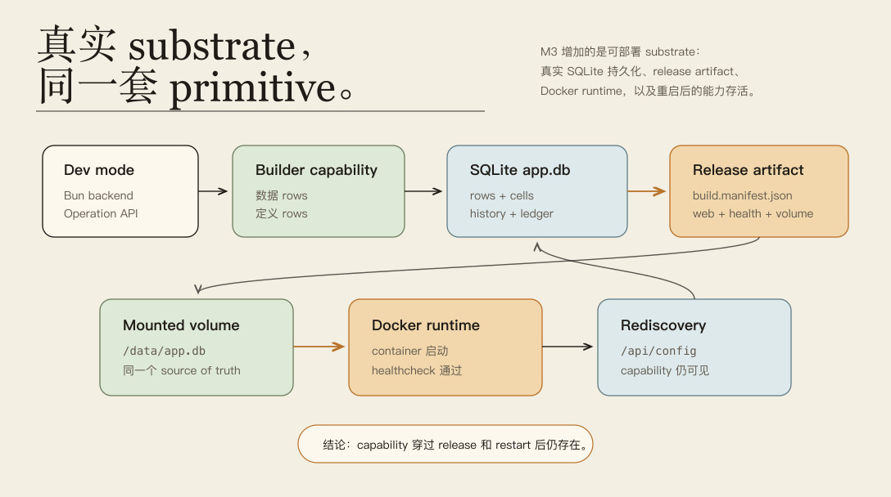
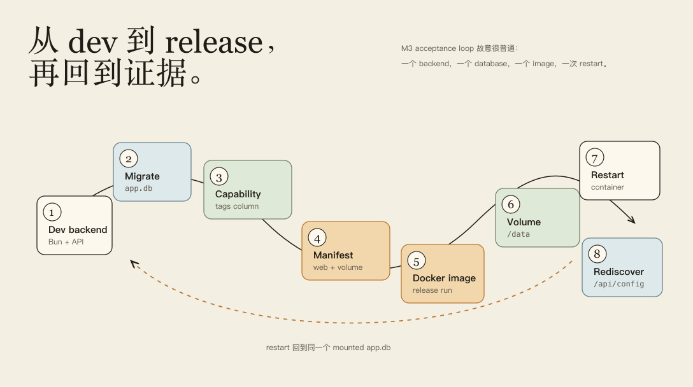
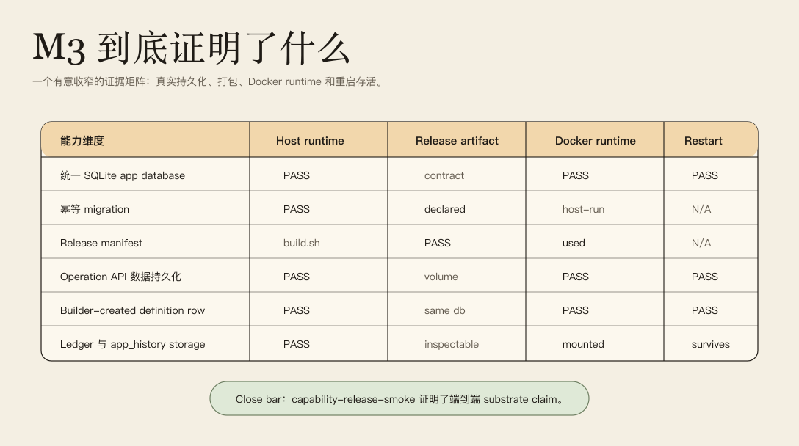
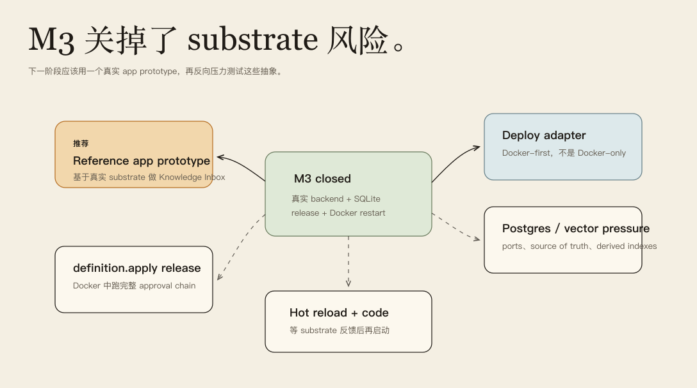

# Milestone 3 快照：可部署 App Substrate

**日期：** 2026-05-01
**状态：** 用于团队对齐的 closed snapshot
**受众：** 0 预备知识的团队成员
**范围：** M3 证明了什么、明确没有证明什么，以及下一阶段决策门应该怎么读。
**English version:** [Milestone 3 Snapshot](./milestone-3-snapshot.md)

摘要：

> M1 证明 app definition 可以作为 runtime primitive 被治理。M2 证明 AI-created software capability 可以进入企业级治理证据链。M3 证明这条 primitive chain 不只活在 demo runtime 里：它可以落到真实 SQLite app database、release manifest、Docker image、mounted volume，并在容器重启后继续被 runtime rediscover。

## Executive Summary

M3 是第一个“真实 substrate”里程碑。它不试图一次做完 enterprise security、hot reload 或 multi-tenant runtime。它回答一个更基础的问题：**Pneuma 在 M1/M2 立住的 primitives，碰到真实持久化和部署之后还成立吗？**

当前证明链路是：

```text
dev mode
  -> SQLite app database
  -> Builder-created data + definition rows
  -> app_history + permission ledger in the same app.db
  -> release manifest
  -> Docker image
  -> mounted /data/app.db volume
  -> container restart
  -> /api/config rediscovers the Builder-created capability
```

这个 milestone 有意收窄。SQLite、Bun、Drizzle、Docker 都是 implementation choices，不是新的 framework semantics。真正的长期结论是：一个 pneuma-app 可以变成可部署单元，同时不把 app-definition evolution 退化成 codegen、DDL generation 或额外的 JSON/file overlay 通道。

| M3 之前 | M3 之后 |
|---|---|
| M1/M2 主要运行在 framework/demo runtime state 上。 | canonical template 可以运行在真实 SQLite app database 上。 |
| app data、app definition、history、ledger 有内存态路径。 | reference app 有统一 SQLite substrate。 |
| `build.sh` / `deploy.sh` 更多是 lifecycle 概念。 | `build.sh` 产出 release manifest，Docker 可以运行 app。 |
| restart persistence 是设计 claim。 | Docker smoke tests 验证 data 和 capability 重启后仍存在。 |
| “deployable app” 还偏架构意图。 | 现在有 Docker-first proof、mounted volume 和 `/healthz`。 |

## Milestone Thesis

> Builder/Agent 创建出来的 app capability 可以被持久化、打包、运行、重启，并通过同一套 Pneuma primitive model 被 rediscover。

M3 证明了：

- **Persistence substrate：** app rows、definition rows、`app_history`、migration metadata、permission ledger events 可以落在同一个 SQLite `app.db`。
- **Release substrate：** bookmarks reference template 可以产出 release manifest，包含 web process、healthcheck、migration command、volume contract。
- **Deployable runtime：** Docker 可以用 `/data/app.db` 运行 app，重启后保留 user data 和 Builder-created capability surface。

M3 不是：

- 不是 production IAM；
- 不是 multi-tenant SaaS；
- 不是 distributed transaction/concurrency hardening；
- 不是 full hot reload；
- 不是 Docker 或 SQLite 会成为永久平台的结论。

## System At A Glance

M3 的架构洞察是：**第一个真实 substrate 是在 primitive 下面，而不是在 primitive 上面。** SQLite 和 Docker 不替代 Table / Operation / View / PolicyRule；它们让这些 primitives 变得持久、可打包、可运行。



从左到右读：Dev mode 和 Builder capability 写入同一个 SQLite `app.db`；release manifest 说明 web process、health endpoint、migration command、volume contract；Docker 用 `/data/app.db` 跑 app；restart 后，`/api/config` 仍然暴露 capability。

## What Is Proven

| 能力 | 当前证明 |
|---|---|
| 统一 SQLite app database | `openPneumaSqliteDatabase(...)` 打开一个包含 runtime schema 和 migration metadata 的 `app.db`。 |
| 幂等 physical migration | SQLite migration tests 创建 schema、记录 schema version，并验证重复 migration 安全。 |
| Persistent runtime substrate | Runtime tests 验证 rows、definition rows、`app_history` 和 config rediscovery 在重新打开 database 后仍存在。 |
| Durable permission ledger | `SqlitePermissionLedgerStore` 可以把 permission events 写入并重新读回同一个 SQLite substrate。 |
| Template lifecycle integration | `templates/bookmarks-core-domain/scripts/migrate.sh` 创建 `data/app.db`；`build.sh` 产出 release metadata。 |
| Release manifest contract | `build.manifest.json` 校验 web process、healthcheck、migrations、volume + SQLite path。 |
| Docker-first deployment | `templates/bookmarks-core-domain/Dockerfile` 和 `docker-compose.yml` 用 `/data/app.db` 运行 reference app。 |
| Operation API persistence | Docker smoke 通过真实 HTTP Operation API 写 bookmark，重启 container 后再读回。 |
| Builder-created capability survival | Capability smoke 在 release 前写入 `bookmarks.tags` definition row，运行 Docker、验证 `/api/config`，重启后再次验证 `/api/config`。 |

## Current Substrate Surface

M3 在现有 primitive surface 下面加了一层具体 substrate：

```text
Primitive surface
  Table / CellType / Operation / View / PolicyRule / app_history / permission ledger

Runtime substrate
  Bun HTTP server
  SQLite app.db
  idempotent migrations
  release manifest
  Docker image
  mounted /data volume
```

这个边界很重要。Builder/Agent definition evolution 仍然是 runtime governed data：

```text
add_table
add_table_column
add_operation
add_view
add_policy_rule
```

这些变化**不会**变成 Drizzle migrations 或 physical DDL。Drizzle/SQLite 管理 framework-owned physical schema；Pneuma primitives 管理 app evolution。

## Acceptance Loop

M3 demo 应该被讲成 release loop，而不是 UI 动画：



1. 从 bookmarks reference backend 的 dev mode 开始。
2. Migrate 一个真实 SQLite `data/app.db`。
3. 创建或 seed 一个 Builder-created capability，目前是 `bookmarks.tags` column。
4. Build release manifest，包含 web process、healthcheck、migration command、volume contract。
5. Build 并运行 Docker image。
6. 把同一个 app database 挂载成 `/data/app.db`。
7. Restart container。
8. 验证 `/api/config` 仍然暴露 capability。

Demo 成功句：

```text
Builder/Agent 创建出的 capability 能穿过 SQLite 持久化、release manifest、Docker 打包和容器重启，并且仍然能被 Pneuma primitives 解释和检查。
```

## Evidence Matrix



可直接运行的 verification set：

```bash
bun test packages/core-domain/test/persistence/sqlite-database.test.ts packages/core-domain/test/persistence/sqlite-migrations.test.ts packages/runtime/test/deployable-substrate.test.ts packages/core/test/permission-ledger-sqlite.test.ts templates/bookmarks-core-domain/test/deployable-substrate.test.ts examples/m3-deployable-substrate/smoke.test.ts examples/m3-deployable-substrate/docker-smoke.test.ts examples/m3-deployable-substrate/capability-release-smoke.test.ts

bun test packages/runtime/test/definition-loader.test.ts packages/runtime/test/definition-apply.test.ts packages/core/test/permission-ledger.test.ts packages/core/test/artifact.test.ts

docker compose -f templates/bookmarks-core-domain/docker-compose.yml config

bun run typecheck

git diff --check
```

这份 snapshot 前最后一次本地验证结果：

```text
M3 substrate suite: 10 pass, 0 fail
M1/M2 guard suite: 31 pass, 0 fail
docker compose config: pass
typecheck: pass
diff check: pass
```

## Demo Runbook

命令级 demo runbook 见 [`examples/m3-deployable-substrate/README.md`](../../examples/m3-deployable-substrate/README.md)。

推荐团队分享流程：

| Step | 展示什么 | 讲什么 |
|---|---|---|
| 1 | M1/M2 一页回顾 | “我们已经证明 governed app evolution 和 governance evidence。” |
| 2 | `m3-deployable-substrate.zh-CN.png` | “M3 问的是：这个 primitive 能不能穿过真实 persistence 和 release？” |
| 3 | `m3-release-loop.zh-CN.png` | “完整 acceptance loop 是 dev、migrate、capability、build、Docker、volume、restart、rediscover。” |
| 4 | 跑或引用 `docker-smoke.test.ts` | “Operation API 写真实数据到 mounted SQLite volume，restart 后还能读回。” |
| 5 | 跑或引用 `capability-release-smoke.test.ts` | “Builder-created definition row 也穿过同样 release/restart 路径。” |
| 6 | `m3-evidence-matrix.zh-CN.png` | “这就是已证明范围；空白处是刻意保留。” |
| 7 | `m3-next-gate.zh-CN.png` | “下一步应该用真实 app prototype 压力测试抽象，而不是继续打磨 demo infrastructure。” |

## Why These Design Choices

| 选择 | 为什么 | 代价 |
|---|---|---|
| SQLite first | 真实持久化、低运维成本、volume 语义简单。 | 单进程约束；不是 production multi-runtime。 |
| Drizzle-shaped physical schema | 成熟 TS migration 路径，符合当前 monorepo stack。 | 必须避免 Drizzle objects 泄漏到 domain model。 |
| Docker-first deployment | 具体 release artifact 和 restart proof。 | Docker 必须只是第一个 adapter，不是 deploy 的定义。 |
| Reference template first | 降低认知成本；压力点是 substrate，不是新产品范围。 | 仍然只有一个 domain；第二个 reference app 依然重要。 |

## What This Does Not Prove Yet

| 尚未证明 | 为什么重要 |
|---|---|
| Docker 中跑完整 `definition.apply` approval chain | Capability smoke 是 release 前直接写 definition row 到 SQLite；它证明 substrate persistence，不证明完整 M2 approval path 在 release runtime 中闭环。 |
| Production migration strategy | M3 migration 幂等且足够支撑 prototype；rollback/down migrations 和 hosted operational workflows 没解决。 |
| Postgres adapter | schema 足够 portable，保留了门；但还没有 Postgres implementation。 |
| Qdrant / semantic index | M3 保持 relational DB 作为 source of truth；vector store 仍是未来 derived index adapter。 |
| Multi-runtime concurrency | SQLite proof 假设简单 runtime；没有 distributed lock 或 database compare-and-swap。 |
| Production deployment adapter | reference template 有 Docker files；还没有 generalized deploy-adapter package。 |
| Release mode Runtime Agent | release app 跑的是 app backend；还没有为 end users 嵌入 Runtime Agent。 |
| 更真实的产品 app | Reader Bookmarks 仍是教学/reference app，不是完整产品 prototype。 |

## Strategic Read

M1 和 M2 回答的是 Pneuma 有没有 defensible primitive。M3 回答的是这个 primitive 能不能离开 demo room。这是一个实质里程碑：framework 现在可以讨论真实 app deployment，而不用改变自己的 ontology。

现在最大风险不再是“能不能持久化一些东西”。更大的风险是：一个更真实的 product-shaped reference app 会不会暴露 Reader Bookmarks 暂时没有触发的抽象缺口。这个压力应该先于 production-grade IAM、完整 Permission Center workflows 或 custom-code hot reload。

所以下一步最有价值的不是立刻把所有 enterprise surface 做满，而是基于这个 substrate 做一个小而真实的 prototype，很可能是 Knowledge Inbox，用它逼 framework 服务一个完整产品体验。

## Recommended Next Phase

推荐 M4 方向：

> 在 M3 substrate 上做一个真实 reference app prototype，再用它反向重排 governance、deployment adapters、hot reload 和 semantic search 的优先级。



| Candidate | 为什么选择 |
|---|---|
| Reference app prototype | 学习价值最高：把 substrate 变成真实产品形态，并暴露 framework 缺口。 |
| Full `definition.apply` release smoke | 补上 M2 governance chain 与 M3 release runtime 之间的剩余 gap。 |
| Deployment adapter abstraction | 把 Docker-first proof 变成 portable deployment model。 |
| Postgres / vector pressure | 测试 storage ports 和 source-of-truth boundary 是否干净。 |
| Hot reload + custom code | 重要，但应跟在真实产品反馈之后，以确保解决的是正确瓶颈。 |

## Team Decision Gate

团队分享时可以问这几个问题：

1. 我们是否同意 M3 以 **deployable substrate proof** 闭合，而不是 production deployment platform？
2. 我们是否接受 SQLite + Docker 作为 first implementations，同时不让它们进入 semantic model？
3. 下一个 reference app 应该继续 Reader Bookmarks，还是更名/重构为 Knowledge Inbox？
4. 下一个 slice 应该先补完整 `definition.apply` release smoke，还是与 product prototype 并行推进？

里程碑边界：

```text
M3 之前：
  Pneuma 已证明 governed app evolution 和 governance evidence。

M3 之后：
  Pneuma 有了真实 app substrate，同一套 primitive 能穿过 persistence、release、Docker 和 restart。
```

## Evidence

最近 M3 commits：

```text
8e3e77a test: prove capability survives docker release restart
36366a1 test: verify docker data persistence through operation api
530b199 test: add docker runtime smoke for M3 substrate
f923ec1 feat: add docker-first deployable substrate demo
b219080 feat: wire bookmarks template to deployable substrate
8cb1e3b feat: describe deployable release manifests
16b3275 feat: persist permission ledger in sqlite
359d9bd feat: persist runtime substrate state in unified sqlite
7045d9a feat: add sqlite migration substrate
468232a feat: add unified sqlite app database wiring
561a784 docs: add M3 deployable substrate plan
```

0 预备知识阅读顺序：

1. [Architecture README](../architecture/README.md)：当前地图。
2. [M1 snapshot](./milestone-1-snapshot.md)：governed app-definition primitive。
3. [M2 snapshot](./milestone-2-snapshot.md)：enterprise governance evidence。
4. 本 M3 snapshot：deployable substrate proof。
5. [M3 demo README](../../examples/m3-deployable-substrate/README.md)：命令和 runbook。

## Appendix — Slice Ledger

| Slice | Durable result |
|---|---|
| M3.0 design close | 双语 design doc 捕捉从 enterprise hardening 转向真实 substrate 的 pivot。 |
| M3.1 unified SQLite database | Runtime storage 打开一个 migrated `app.db`。 |
| M3.2 migrations | Physical schema 和幂等 migration tests 落地。 |
| M3.3 runtime persistence | Rows、definition rows、`app_history` 在 database reopen 后仍存在。 |
| M3.4 permission ledger persistence | Permission ledger 有 SQLite-backed store。 |
| M3.5 release manifest | Build artifact 描述 process、healthcheck、migrations、volume contract。 |
| M3.6 template Docker substrate | Bookmarks reference template 可以作为 Docker image 用 `/data/app.db` 运行。 |
| M3.7 Docker data smoke | Operation API data survives container restart。 |
| M3.8 capability release smoke | Builder-created `bookmarks.tags` capability survives Docker restart and runtime rediscovery。 |
