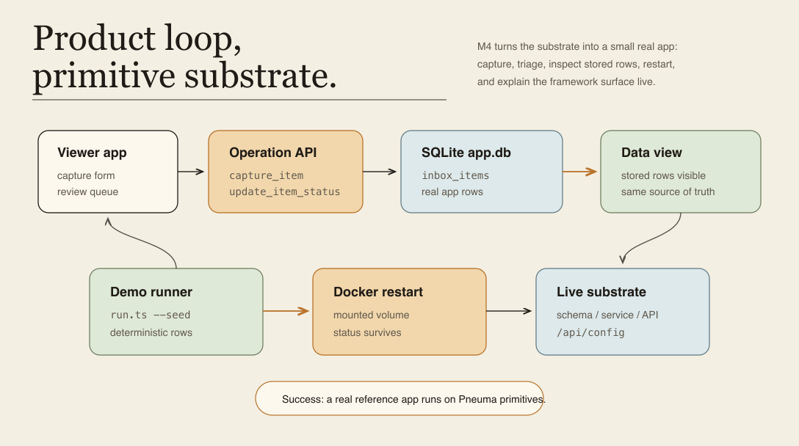
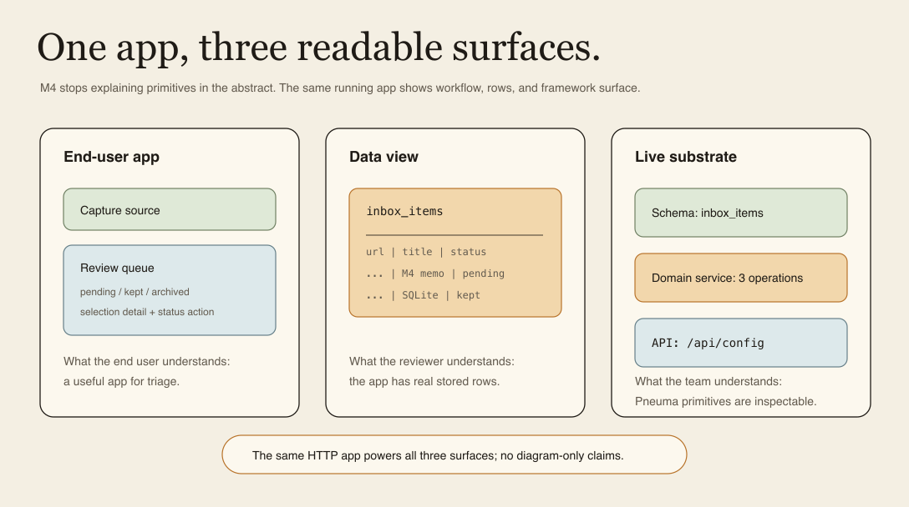
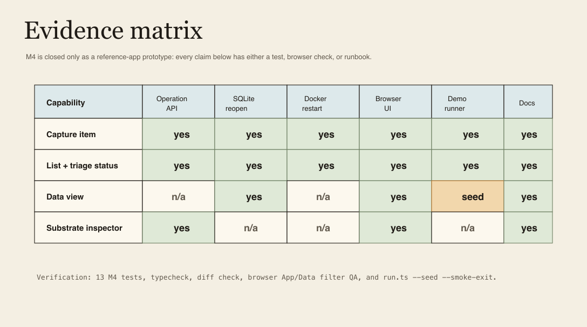

# Milestone 4 Snapshot: Knowledge Inbox Reference App

**Date:** 2026-05-01
**Status:** Closed snapshot for team alignment
**Audience:** teammates with zero Pneuma context
**Scope:** what M4 proves, what it deliberately does not prove, and what should become the next product-pressure gate.
**中文版：** [Milestone 4 快照](./milestone-4-snapshot.zh-CN.md)

中文摘要：

> M1 证明 app definition 可以被治理；M2 证明治理证据链可以解释企业级安全边界；M3 证明 primitive 可以穿过 SQLite / Docker / restart。M4 证明这条链路可以支撑一个小而真实的 reference app：Knowledge Inbox。它不是烟雾测试页面，而是有 capture、triage、data view、live substrate inspector、SQLite 持久化、Docker restart 和一键 demo runner 的产品原型。

## Executive Summary

M4 is the first product-shaped reference app milestone. It does not try to become a full knowledge-management product. It answers a narrower but important question: **can a real app experience sit on top of Pneuma primitives without hiding the framework model from the team?**

The proof chain is now:

```text
end-user capture
  -> capture_item Operation
  -> inbox_items row in SQLite app.db
  -> review queue + status triage
  -> Data view over the same stored rows
  -> Live substrate inspector for schema / domain service / API
  -> Docker restart with mounted volume
  -> deterministic demo runner for team replay
```

| Before M4 | After M4 |
|---|---|
| M3 proved substrate with a teaching template. | M4 runs a named reference app on that substrate. |
| Team demos still required knowing the primitive story first. | The app now explains the primitive story through product, data, and substrate views. |
| Browser validation was mostly manual. | Viewer contract, runner contract, Docker smoke, and browser QA cover the demo path. |
| Starting the demo required remembering several commands. | `examples/m4-knowledge-inbox/run.ts --seed` is the canonical live entry. |
| Knowledge Inbox was a proposed pressure test. | Knowledge Inbox is now a concrete template and example. |

## Milestone Thesis

> A Pneuma reference app can be useful as an app while remaining inspectable as a framework primitive system.

That distinction matters. M4 is not a claim that Pneuma has a finished product. It is a claim that the substrate no longer only exists as infrastructure: it can carry a coherent app loop that non-Pneuma teammates can understand from the outside.

## System At A Glance



The key M4 move is the App/Data/Substrate split:

- **App view:** what the end user does — capture, review, keep, archive.
- **Data view:** what the system stores — `inbox_items` rows.
- **Live substrate:** what the framework exposes — schema, domain service Operations, `/api/config`, `/healthz`.

This is why the demo is easier to understand than earlier primitive-only screens. A teammate can start from the app, then look down into rows, then look sideways into the framework contract.

## What Is Proven

| Capability | Current proof |
|---|---|
| Product-shaped reference app | `templates/knowledge-inbox-core-domain` ships a usable Knowledge Inbox viewer, backend, lifecycle scripts, SQLite config, Dockerfile, and compose file. |
| Domain schema | `inbox_items` stores URL, title, source, summary, status, and created timestamp. |
| Operation contract | `capture_item`, `list_inbox_items`, and `update_item_status` have declaration tests and real HTTP invocation tests. |
| SQLite persistence | Local smoke boots runtime, captures an item, reopens the same app database, and reads it back. |
| Docker restart survival | Docker smoke builds the image, writes and updates a row through HTTP, restarts the container, and verifies the same row/status from `/data/app.db`. |
| Product UI | The vanilla viewer supports capture, review queue, status filters, selected detail, and App/Data view switching. |
| Live substrate explanation | The viewer fetches `/api/config` and `/healthz`, then renders Schema, Domain Service, and API lanes. |
| Deterministic demo replay | `examples/m4-knowledge-inbox/run.ts --seed` starts the real app and seeds three deterministic rows through public Operations. |
| Browser confidence | In-app browser QA verified seeded App view, Data view, kept filter behavior, and zero console errors. |
| M3/M4 bridge | `definition-apply-release-smoke` proves a governed `definition.apply` capability can be created before Docker release and survive restart. |

## Reference App Surface



Current Knowledge Inbox is intentionally small:

```text
Schema:
  inbox_items(url, title, source, summary, status, created_at_cell)

Domain service:
  capture_item(input: url, title?, source?, summary?) -> { id, url, status }
  list_inbox_items() -> inbox_items[]
  update_item_status(item_id, status) -> { id, status }

App:
  capture form
  pending / kept / archived queue filters
  selected item detail
  Data view table
  live substrate inspector
```

The important part is not feature breadth. The important part is that every visible product behavior maps to a declared Operation and a stored row, and the viewer makes that mapping visible.

## Demo Runbook

Canonical live demo:

```bash
bun run examples/m4-knowledge-inbox/run.ts --seed --port 8876
```

If the port is occupied:

```bash
bun run examples/m4-knowledge-inbox/run.ts --seed --port 0
```

Automated smoke mode:

```bash
bun run examples/m4-knowledge-inbox/run.ts --seed --smoke-exit --port 0
```

Recommended team-share flow:

| Step | What to show | What to say |
|---|---|---|
| 1 | M1-M3 recap | "We proved governance, enterprise evidence, and deployable substrate." |
| 2 | Knowledge Inbox App view | "Now the primitive chain carries a product loop." |
| 3 | Capture one source | "The UI is invoking a declared Operation, not custom ad-hoc code." |
| 4 | Data view | "The app has real stored rows in SQLite." |
| 5 | Live substrate inspector | "The running app explains its schema, domain service, and API." |
| 6 | Docker smoke or quote output | "The same row/status survives release and restart." |
| 7 | Evidence matrix | "This is what M4 proves; the gaps are deliberate." |

## Evidence Matrix



Copy-paste verification set:

```bash
bun test templates/knowledge-inbox-core-domain/test/operation-declarations.test.ts templates/knowledge-inbox-core-domain/test/deployable-substrate.test.ts templates/knowledge-inbox-core-domain/test/viewer-contract.test.ts examples/m4-knowledge-inbox/smoke.test.ts examples/m4-knowledge-inbox/docker-smoke.test.ts examples/m4-knowledge-inbox/run.test.ts

bun run examples/m4-knowledge-inbox/run.ts --seed --smoke-exit --port 0

bun test examples/m3-deployable-substrate/definition-apply-release-smoke.test.ts

bun run typecheck

git diff --check
```

Latest local verification before this snapshot:

```text
M4 focused suite: 13 pass, 0 fail
Live runner smoke: pass
M3/M4 bridge smoke: 1 pass, 0 fail
Browser QA: seeded App view, Data view, kept filter, 0 console errors
Typecheck: pass
Diff check: pass
```

## What This Does Not Prove Yet

| Not proven | Why it matters |
|---|---|
| A full knowledge-management product | M4 is a reference app prototype, not a product launch. Search, ingestion, deduping, and collaboration remain future work. |
| Runtime Agent in release mode | End users can use the app, but no runtime agent is embedded in the released app yet. |
| Semantic search / vector store | Qdrant-like search remains a future derived index. SQLite rows remain source of truth. |
| Postgres adapter | M4 keeps SQLite + volume as the first implementation. The storage boundary is still designed to leave a Postgres path open. |
| Hot reload for definition changes | M4 still accepts restart-based rediscovery for substrate-level proof. |
| Multi-user enterprise workflow in this app | M2 primitives exist, but Knowledge Inbox does not yet expose a full admin / permission center workflow. |
| Builder-authored app evolution inside Knowledge Inbox | The M3/M4 bridge proves governed definition.apply through release, but Knowledge Inbox itself is not yet an agent-evolving app during the demo. |
| Production deployment adapter | Docker is still the first concrete release target, not the generalized deployment abstraction. |

## Strategic Read

M4 changes the project conversation. We can now stop asking whether the substrate can host an app at all. It can. The better question is which real product pressure should stress the abstraction next.

The strongest next pressure is not "more demo polish." It is a capability that forces a new framework boundary:

- **semantic retrieval:** add a derived vector/search index without making it source of truth;
- **agent-built app evolution inside Knowledge Inbox:** let the Builder add priority/tags/review views through `definition.apply`;
- **scaffold:** make it easy for an agent or developer to start a new reference app without copying by hand;
- **runtime agent:** let the finished app answer end-user questions over its own rows;
- **deployment adapter:** make Docker one adapter rather than the deploy model.

## Recommended Next Gate

Recommended M5 direction:

> Add one capability that forces Knowledge Inbox to pressure-test a missing framework boundary, while keeping the app understandable as a product.

The most valuable candidates:

| Candidate | Why choose it |
|---|---|
| Semantic search as derived index | Tests source-of-truth boundary and future Qdrant path. |
| Builder adds `priority` / `topic` through `definition.apply` | Connects M1/M2 app evolution directly to the M4 reference app. |
| Reference app scaffold | Tests whether an agent should start from a scaffold or from scratch. |
| Runtime Agent over inbox rows | Tests the second-agent lifetime and release-mode user value. |
| Deployment adapter abstraction | Turns Docker-first proof into a portable deployment story. |

## Team Decision Gate

Use these questions in the team share:

1. Do we agree M4 closes as a **reference app prototype**, not a full product?
2. Does the App/Data/Substrate split make Pneuma easier for zero-context teammates to understand?
3. Should M5 pressure semantic retrieval first, or should it connect `definition.apply` directly into Knowledge Inbox?
4. Do we want a scaffold/generator before building the second reference app?

Milestone boundary:

```text
Before M4:
  Pneuma had governed primitives and a deployable substrate.

After M4:
  Pneuma has a real reference app that makes the primitive chain visible through product use, data inspection, and runtime substrate inspection.
```

## Evidence

Recent M4 commits:

```text
a8d411d feat: add knowledge inbox data view
19a939e feat: expose knowledge inbox substrate
1b5fb1a feat: refine knowledge inbox viewer
1a8e84a test: add knowledge inbox docker smoke
ac572dd test: prove knowledge inbox persistence
927afdf feat: define knowledge inbox reference template
5f5acde test: prove governed capability survives release
0a05f70 docs: plan M4 knowledge inbox
```

Reading path for zero-context teammates:

1. [Architecture README](../architecture/README.md) for the current map.
2. [Milestone 1 Snapshot](./milestone-1-snapshot.md) for governed app-definition evolution.
3. [Milestone 2 Snapshot](./milestone-2-snapshot.md) for enterprise governance evidence.
4. [Milestone 3 Snapshot](./milestone-3-snapshot.md) for deployable substrate.
5. This M4 snapshot for the first product-shaped reference app.
6. [M4 Knowledge Inbox README](../../examples/m4-knowledge-inbox/README.md) for the runnable demo.
