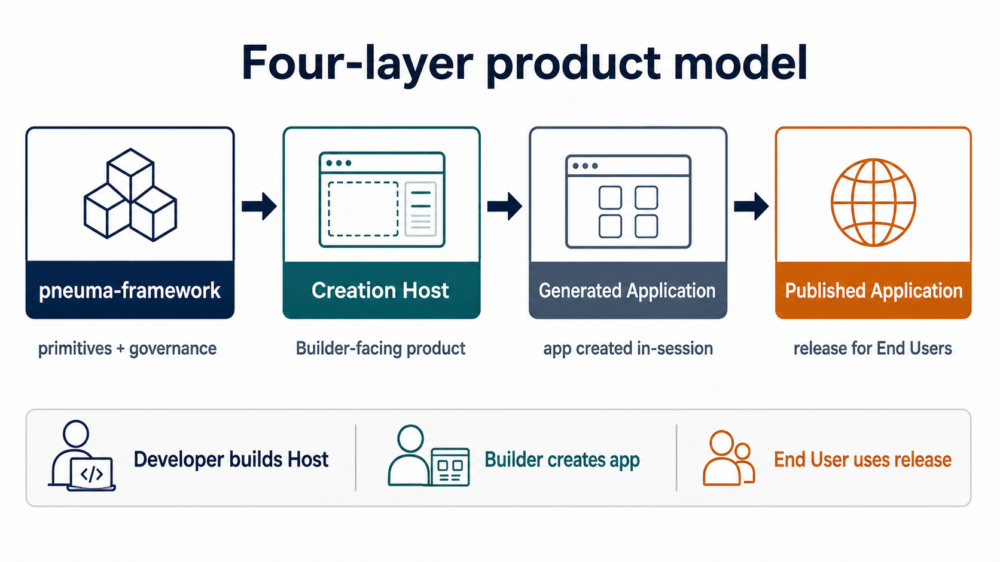
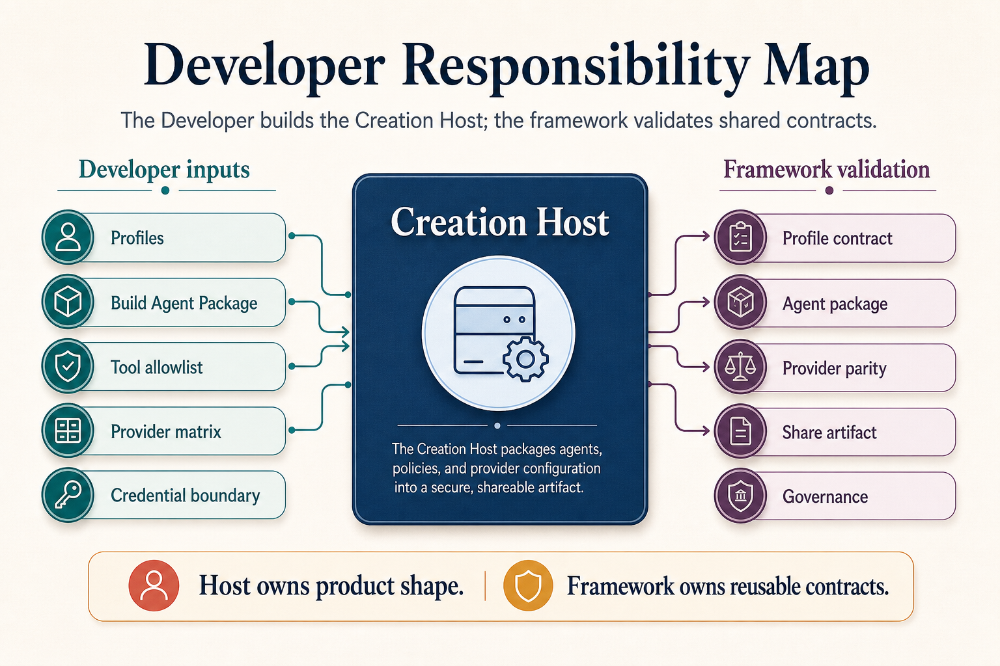
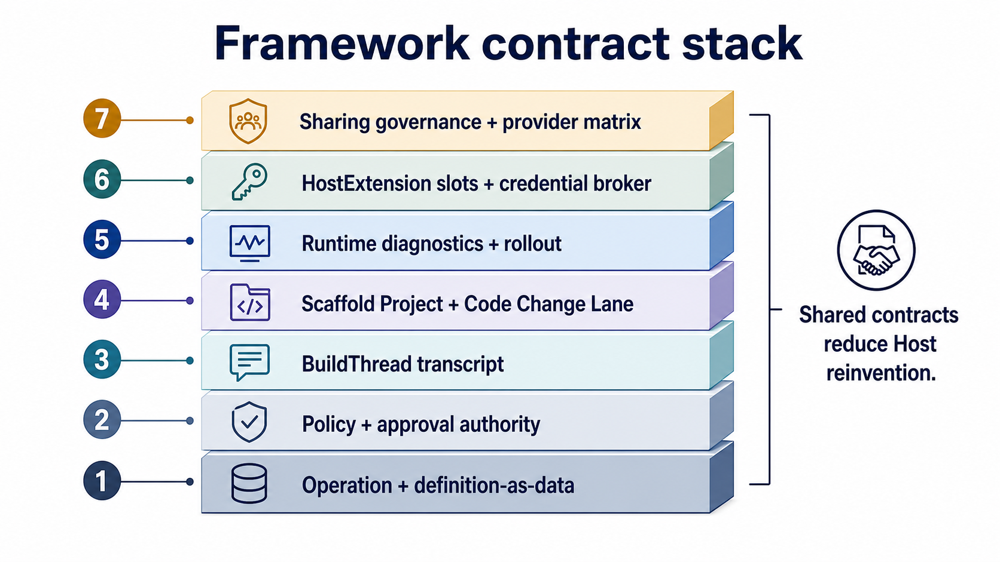
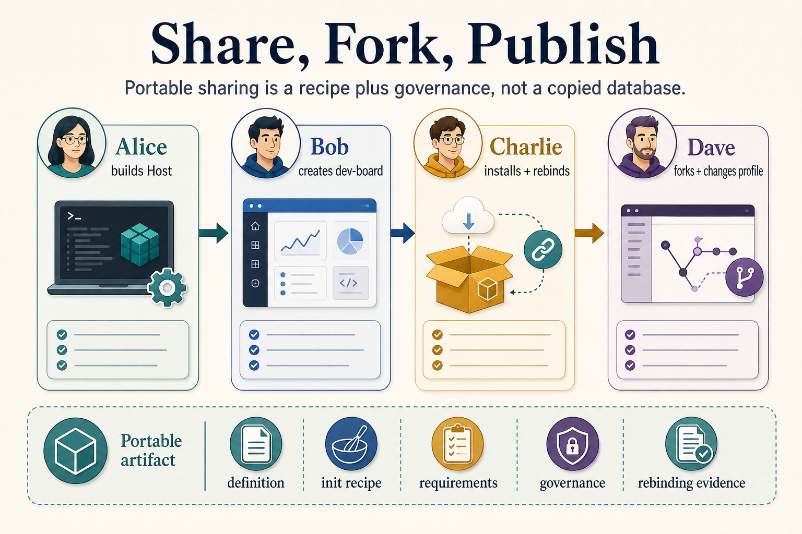

# Start Here: Build A Creation Host

**Audience:** Developers evaluating or building on `pneuma-framework`  
**Status:** RC accepted at `pneuma-rc-0.1.0`; latest tagged developer-contract patch is `pneuma-rc-0.1.3`; M26-M31 are post-RC stabilization snapshots, not a new release tag
**Chinese version:** [start-here.zh-CN.md](./start-here.zh-CN.md)

This is the first document to read if you are approaching Pneuma from the outside.

The shortest accurate description is:

> `pneuma-framework` is infrastructure for building **AI-native Creation Hosts**. A Creation Host lets a Builder create, inspect, evolve, publish, and operate Generated Applications by talking to a Build-phase Agent.

This means you are not just building one app. You are building the product surface where other apps can be created.

## 1. The Product Model



Keep this model explicit:

```text
pneuma-framework
  -> Creation Host
  -> Generated Application
  -> Published Application
```

The framework is the primitive layer. The Creation Host is your Builder-facing product. A Generated Application is the app produced inside that Host. A Published Application is the active version opened by End Users.

Most design mistakes come from compressing these four things into "the app." When a document says "pneuma app," clarify whether it means the Host, the generated app, or the published release.

## 2. What You Build As A Developer



As a Developer, your main job is to construct a Creation Host with clear boundaries:

- which profiles and stacks Builders can choose;
- which Build-phase Agent package and semantic tools the Host provides;
- how preview, inspection, publish, restart, and rollback work;
- which provider capabilities are supported and how parity is proven;
- how portable sharing, forking, and credential rebinding are governed.

The framework validates shared contracts, but it should not absorb your product-specific Host UX, provider implementation, or domain template logic.

## 3. How A Builder Creates An App


A Builder works inside your Creation Host:

1. The Builder describes the desired application or change.
2. The Build-phase Agent turns intent into a proposal using framework semantic tools.
3. The Host shows preview, schema/data inspection, transcript, impact, and approval evidence.
4. Approved changes become a Generated Application version.
5. The Builder can publish that version and operate it as a Published Application.

The important primitive is not "Agent edits files." The important primitive is that user action, agent tool call, approval, evidence, and runtime behavior can be traced through one governed framework path.

## 4. Why The Contracts Exist



The framework is intentionally opinionated about contracts that many Creation Hosts need:

- Operation and definition-as-data for governed app evolution;
- Authorization Kernel, approval tokens, permission ledger, and audit evidence;
- lifecycle semantic tools over implementation scripts;
- release candidate, rollout, and recovery evidence;
- BuildThread for semantic Builder conversation, proposal, decision, and execution receipt turns;
- Scaffold Project and Code Change Lane for governed draft source changes;
- Runtime Diagnostic Surface for predictable Host/runtime composition;
- HostExtension Slot Contract for portable Host-owned open-ended contributions;
- Host Credential Broker utilities for session cookies, OAuth state, callback binding, credential refs, and no-secret rebinding evidence;
- Build Agent Package, provider matrix, share artifact, sharing governance, and credential rebinding validation.

The goal is not "maximum abstraction." The goal is that a Developer can build a real Host without reinventing the agent loop, governance path, preview/publish loop, and portability checks.

## 5. How Sharing And Forking Stay Portable



The current RC evidence uses the Alice/Bob/Charlie/Dave story:

- Alice builds a Creation Host on Pneuma.
- Bob uses it to create `dev-board`.
- Charlie installs Bob's shared artifact and rebinds personal credentials.
- Dave forks the artifact, chooses a different provider profile, removes a capability, and publishes his own version.

This is why share artifacts exclude source databases and secrets. Portable artifacts carry app definition, init recipe, provider requirements, governance, and credential rebinding requirements. The receiving Builder supplies their own credentials and target profile.

## Read Next

Use this order:

1. [Getting Started](./getting-started.md) — run scaffold, doctor, and reference Host loops.
2. [Creation Host Contract](./creation-host-contract.md) — understand the minimum Host contract and authoring kit files.
3. [Release Candidate Snapshot](../architecture/release-candidate-snapshot.md) — see why `pneuma-rc-0.1.0` was accepted.
4. [RC 0.1.1 Patch Snapshot](../architecture/release-candidate-0.1.1-snapshot.md) — see which DevBoard feedback became developer-contract polish.
5. [Upgrade To RC 0.1.1](./upgrading-to-rc-0.1.1.md) — update a downstream Host already using `pneuma-rc-0.1.0`.
6. [Upgrade To RC 0.1.2](./upgrading-to-rc-0.1.2.md) — migrate downstream Builder conversation code to BuildThread.
7. [Upgrade To RC 0.1.3](./upgrading-to-rc-0.1.3.md) — adopt the executable Code Change Lane for draft source changes.
8. [BuildThread Guide](./build-thread.md) — use framework-owned semantic transcript for Builder conversation.
9. [Scaffold Project Contract](./scaffold-project-contract.md) — declare generated-app source boundaries and guardrails before letting agents draft code.
10. [Code Change Lane](./code-change-lane.md) — prepare proposal evidence, apply approved draft code, and record receipts.
11. [HostExtension Slots](./host-extension-slots.md) — package portable Host-owned open-ended contributions against Developer-declared slots.
12. [Host Credential Broker Utilities](./credential-broker.md) — wire sessions, OAuth callback binding, credential refs, and no-secret rebinding evidence.
13. [AppConfig Authoring](./app-config-authoring.md), [Runtime Composition](./runtime-composition.md), and [Release Rollout Authoring](./release-rollout-authoring.md) — read these before writing a real Host runtime.
14. [M31 Snapshot](../architecture/milestone-31-snapshot.md), [M30 Snapshot](../architecture/milestone-30-snapshot.md), [M29 Snapshot](../architecture/milestone-29-snapshot.md), [M28 Snapshot](../architecture/milestone-28-snapshot.md), [M27 Snapshot](../architecture/milestone-27-snapshot.md), and [M26 Snapshot](../architecture/milestone-26-snapshot.md) — understand the post-RC stabilization work after the latest tag.
15. [M25 Story Kit](../../examples/m25-alice-creation-host-prototype/STORY.md) — use the Alice/Bob/Charlie/Dave story for team explanation.
16. [Architecture Index](../architecture/README.md) — browse ADRs, milestones, and historical evidence when you need depth.

## What This RC Does Not Claim

This RC is not a production SaaS platform. It does not include hosted identity, production credential storage, marketplace transport, broad cloud deployment adapters, a Runtime Agent product surface, hot reload, or a full Pneuma 2.x rebuild. M30 adds local/reference Host credential utilities, and M31 proves downstream adoption; neither is a hosted credential service.

It does claim that the core model is coherent enough for Developers to start building Creation Hosts and pressure-testing real product shapes against the framework contracts.
