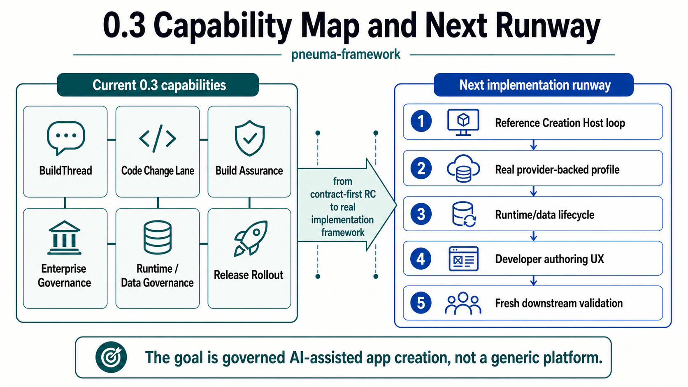

# Start Here: Build A Creation Host

**Audience:** Developers evaluating or building on `pneuma-framework`
**Status:** RC accepted. Latest tagged developer-contract patch is `pneuma-rc-0.1.3`; M26-M33 are post-RC stabilization evidence, not a new release tag.
**Chinese version:** [start-here.zh-CN.md](./start-here.zh-CN.md)

This is the first document to read if you are approaching Pneuma from the outside.

The shortest accurate description is:

> `pneuma-framework` is infrastructure for building **AI-native Creation Hosts**. A Creation Host lets a Builder create, inspect, evolve, publish, and operate Generated Applications by talking to a Build-phase Agent.

This means you are not just building one app. You are building the product surface where other apps can be created.

## 1. What Product Layer Am I Building?


Keep this model explicit:

```text
pneuma-framework
  -> Creation Host
  -> Generated Application
  -> Published Application
```

The framework is the primitive layer. The Creation Host is your Builder-facing product. A Generated Application is the app produced inside that Host. A Published Application is the active version opened by End Users.

Most design mistakes come from compressing these four things into "the app." When a document says "pneuma app," clarify whether it means the Host, the generated app, or the published release.

## 2. What Does A Creation Host Own?


As a Developer, your main job is to construct a Creation Host with clear boundaries:

- which profiles and stacks Builders can choose;
- which Build-phase Agent package and semantic tools the Host provides;
- which source boundaries and guardrails the Agent must respect;
- how preview, inspection, publish, restart, and rollback work;
- which provider capabilities are supported and how parity is proven;
- how credentials, sharing, forking, and rebinding are governed.

The framework validates shared contracts, but it should not absorb your product-specific Host UX, provider implementation, deployment choice, or domain template logic.

## 3. How Does One Builder Intent Become A Governed Change?


A Builder works inside your Creation Host:

```text
Builder intent
  -> BuildThread turn
  -> Agent proposal
  -> impact / diff / evidence disclosure
  -> Builder approval or rejection
  -> framework or Host execution lane
  -> execution receipt
  -> preview, publish, restart, rollback, and inspection evidence
```

The important primitive is not "Agent edits files." The important primitive is that user intent, agent proposal, approval, execution, evidence, and recovery can be traced through one governed path.

That is the difference between an AI coding demo and an AI-native creation framework.

## 4. Which Contracts Keep The Loop Safe?


Pneuma is intentionally opinionated about contracts that many Creation Hosts need:

- **Operation + definition-as-data** for governed app evolution.
- **Authorization Kernel, approval tokens, permission ledger, and app history** for authority separation.
- **BuildThread** for semantic Builder conversation, proposal, decision, and execution receipt turns.
- **Scaffold Project + Code Change Lane** for governed draft source changes.
- **Build Change Assurance** for risk classification, readiness, blocking reasons, and evidence references.
- **Runtime Diagnostic Surface** for predictable Host/runtime composition.
- **Release Rollout State** for candidate, active, previous, restart, and rollback evidence.
- **HostExtension Slots** for portable Host-owned open-ended contributions.
- **Host Credential Broker utilities** for session cookies, OAuth state, callback binding, credential refs, and no-secret rebinding evidence.
- **Build Agent Package, provider matrix, share artifact, sharing governance, and credential rebinding contracts** for portable sharing and fork/install governance.

The goal is not maximum abstraction. The goal is that a Developer can build a real Host without reinventing the agent loop, governance path, preview/publish loop, and portability checks.

## 5. What Is Proved, And What Comes Next?



The current evidence chain is easier to read as bands, not as a milestone list:

| Band | What it proved |
|---|---|
| **M1-M11** | Core primitives can govern app definition, permissions, approval, recovery, deployment substrate, semantic index, and rollout state. |
| **M12-M20** | A Creation Host can create, preview, inspect, evolve, approve, publish, restart, roll back, and carry a non-table-first open-ended app without collapsing framework boundaries. |
| **M21-M25** | Developer onboarding, Authoring Kit, Sharing Governance, RC pressure, and Alice/Bob/Charlie/Dave made the RC story explainable and testable. |
| **M26-M33** | Code Change Lane, runtime diagnostics, HostExtension slots, AgentBackend `runTurn`, credential utilities, downstream adoption, and visible Build Change Assurance stabilized the post-RC developer contract. |

The current post-RC assurance primitive is **Build Change Assurance**:

```text
When a Builder asks an Agent to change an app,
what was proposed,
what evidence was shown,
who approved it,
what changed,
what failed,
and how can the Host recover?
```

This keeps the project anchored on enterprise-grade engineering control for Builder + Build Agent workflows, not generic marketplace artifact trust.

## Read Next

Pick the lane that matches what you are doing.

| Lane | Read |
|---|---|
| **Build a Host** | [Getting Started](./getting-started.md), then [Creation Host Contract](./creation-host-contract.md). |
| **Add governed creation** | [BuildThread](./build-thread.md), [Scaffold Project Contract](./scaffold-project-contract.md), [Code Change Lane](./code-change-lane.md), then [Build Change Assurance](./build-assurance.md). |
| **Compose runtime and release** | [AppConfig Authoring](./app-config-authoring.md), [Runtime Composition](./runtime-composition.md), and [Release Rollout Authoring](./release-rollout-authoring.md). |
| **Adopt post-RC utilities** | [HostExtension Slots](./host-extension-slots.md), [Host Credential Broker Utilities](./credential-broker.md), and the tagged upgrade guides: [0.1.1](./upgrading-to-rc-0.1.1.md), [0.1.2](./upgrading-to-rc-0.1.2.md), [0.1.3](./upgrading-to-rc-0.1.3.md). |

When you need deeper reasoning, use the [Architecture Index](../architecture/README.md). Milestone snapshots and ADRs are preserved there as evidence and decision history; they are not the first reading path.

## What This RC Does Not Claim

This RC is not a production SaaS platform. It does not include hosted identity, production credential storage, marketplace transport, broad cloud deployment adapters, a Runtime Agent product surface, hot reload, or a full Pneuma 2.x rebuild. M30 adds local/reference Host credential utilities, and M31 proves downstream adoption; neither is a hosted credential service.

It does claim that the core model is coherent enough for Developers to build Creation Hosts and pressure-test real product shapes against framework contracts.
