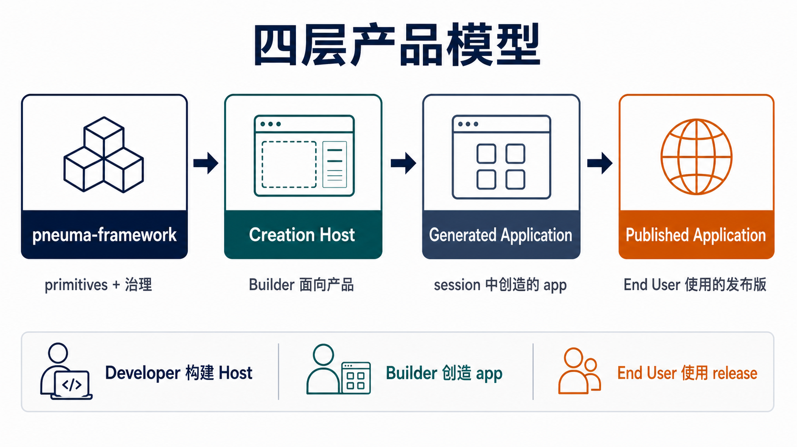
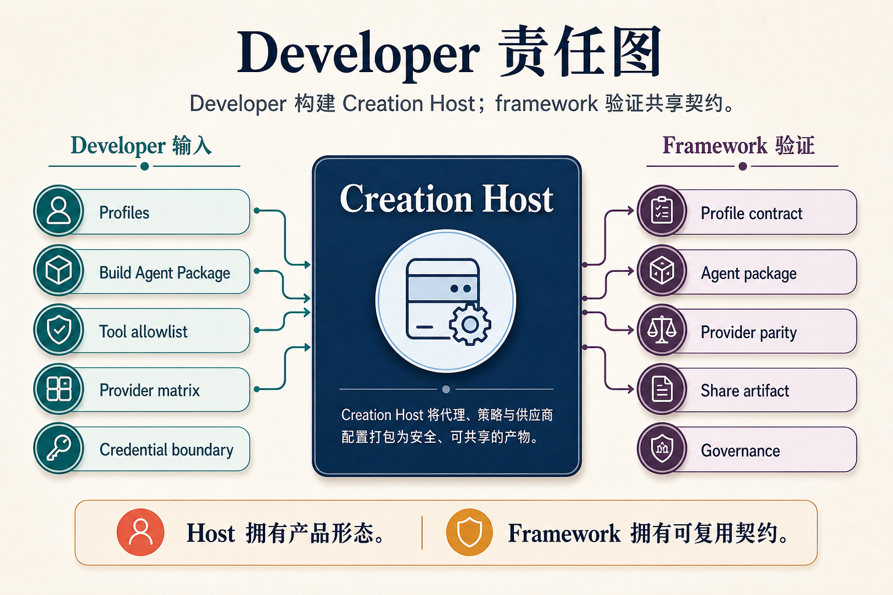
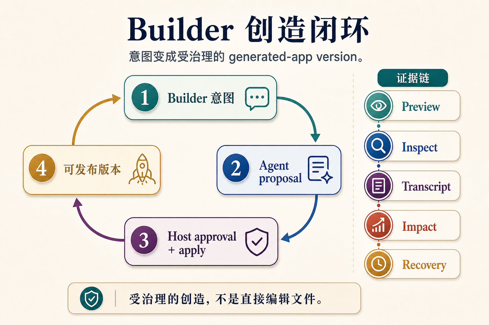
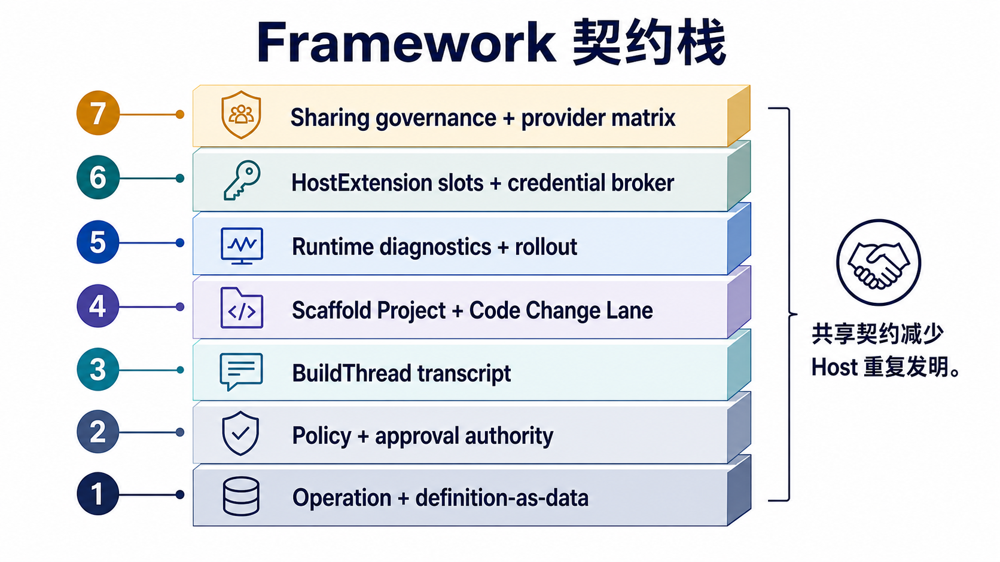
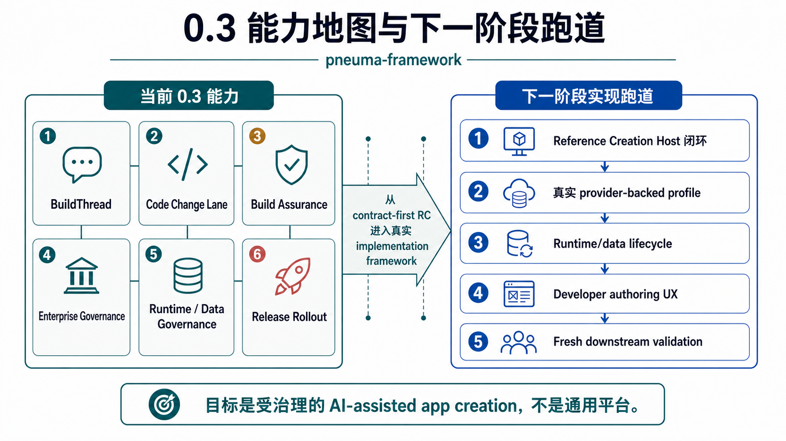

# 从这里开始：构建 Creation Host

**读者：** 正在评估或准备基于 `pneuma-framework` 构建产品的 Developer
**状态：** RC 已接受。最新 enterprise-governance release train 已准备为 `pneuma-rc-0.3.0`；M45 关闭了第一版 0.4.0 implementation-framework slice，交付 `@pneuma-framework/host-kit`；M46 证明 Host Kit 可以支撑产品型 Creation Host；M47 将这条压力样本收口，留下 Alice/Bob/Charlie 边界、version lineage、rollback、controlled generated source artifacts 和真实 opencode evidence；M48 启动更干净的 Workflow App Studio 产品线，并把 Codex app-server 作为默认真实 code-agent lane；M49 正在把 Agent Debug Loop 补到 proposal 创建之前。
**English version:** [start-here.md](./start-here.md)

如果你是第一次从外部进入 Pneuma，这应该是第一篇阅读文档。

最短且准确的描述是：

> `pneuma-framework` 是用于构建 **AI-native Creation Host** 的基础设施。Creation Host 让 Builder 通过和 Build-phase Agent 对话，创建、检查、演进、发布和运营 Generated Application。

这意味着你不是在直接构建一个 app。你是在构建一个能够让别人创造 app 的产品表面。

## 1. 我到底在构建哪一层产品？



请始终显式保留这个模型：

```text
pneuma-framework
  -> Creation Host
  -> Generated Application
  -> Published Application
```

framework 是 primitive 层。Creation Host 是你面向 Builder 的产品。Generated Application 是 Builder 在 Host 里创造出来的 app。Published Application 是 End User 打开的活跃发布版本。

大多数设计错误都来自把这四层压缩成一个“app”。当文档里出现 “pneuma app” 时，先确认它指的是 Host、Generated Application，还是 Published Application。

## 2. Creation Host 拥有什么责任？



作为 Developer，你的主要工作是构建一个边界清晰的 Creation Host：

- Builder 可以选择哪些 profile 和技术栈；
- Host 提供什么 Build-phase Agent package 和 semantic tools；
- Agent 必须遵守哪些 source boundary 和 guardrails；
- preview、inspection、publish、restart、rollback 如何工作；
- 支持哪些 provider capability，以及如何证明不同 provider 的语义一致；
- credentials、sharing、forking、rebinding 如何被治理。

framework 会验证共享契约，但不应该吞掉你的 Host 产品体验、provider 实现细节、部署选择或领域模板逻辑。

## 3. 一个 Builder intent 如何变成受治理的 change？



Builder 在你的 Creation Host 里工作：

```text
Builder intent
  -> BuildThread turn
  -> Agent proposal
  -> impact / diff / evidence disclosure
  -> Builder approval or rejection
  -> framework or Host execution lane
  -> execution receipt
  -> preview, publish, restart, rollback, inspection evidence
```

关键 primitive 不是“Agent 改文件”。关键 primitive 是：用户意图、agent proposal、approval、execution、evidence、recovery 都能穿过同一条受治理的路径。

这就是 AI coding demo 和 AI-native creation framework 的区别。

## 4. 哪些契约让这个闭环可靠？



Pneuma 会对许多 Creation Host 都需要的契约保持主见：

- **Operation + definition-as-data**：治理 app 演进。
- **Authorization Kernel、approval tokens、permission ledger、app history**：分离不同 authority。
- **BuildThread**：承载 Builder conversation、proposal、decision、execution receipt turns。
- **Agent Debug Loop + Scaffold Project + Code Change Lane**：治理 proposal 前 code-agent attempts 和 draft source changes。
- **Build Change Assurance**：表达 risk classification、readiness、blocking reasons、evidence references 和 durable Host-side cases。
- **Enterprise Governance**：在 publish readiness 之前进行基于角色的 review routing。
- **Runtime Diagnostic Surface**：稳定 Host/runtime composition。
- **Runtime / Data Governance**：记录 post-approval runtime/data intent、observation、generation、control receipts 和 data evolution evidence。
- **Creation Host Implementation Kit**：复用 Host assembly，包括 approval、code-change、preview data rehearsal、publish、rollback。
- **Release Rollout State**：记录 candidate、active、previous、restart、rollback evidence。
- **HostExtension Slots**：承载 portable Host-owned open-ended contributions。
- **Host Credential Broker utilities**：处理 session cookies、OAuth state、callback binding、credential refs、no-secret rebinding evidence。
- **Build Agent Package、provider matrix、share artifact、sharing governance、credential rebinding contracts**：支持 portable sharing 和 fork/install governance。

目标不是“无限抽象”。目标是让 Developer 能构建真实的 Host，而不必重新发明 agent loop、governance path、preview/publish loop 和 portability checks。

## 5. 已经证明了什么，接下来是什么？



当前证据链更适合按阶段理解，而不是按 milestone 流水账阅读：

| 阶段 | 证明了什么 |
|---|---|
| **M1-M11** | core primitives 可以治理 app definition、permissions、approval、recovery、deployment substrate、semantic index 和 rollout state。 |
| **M12-M20** | Creation Host 可以 create、preview、inspect、evolve、approve、publish、restart、rollback，并承载非 table-first open-ended app，同时不混淆 framework 边界。 |
| **M21-M25** | Developer onboarding、Authoring Kit、Sharing Governance、RC pressure、Alice/Bob/Charlie/Dave 让 RC 故事可以被解释和测试。 |
| **M26-M38** | Code Change Lane、runtime diagnostics、HostExtension slots、AgentBackend `runTurn`、credential utilities、downstream adoption、visible/durable Build Change Assurance、approval-time review packets、recovery drill matrices、downstream adoption guidance 和 package-consumption gating 稳定了 post-RC developer contract。 |
| **M40-M44** | Production-readiness boundary、enterprise governance roles/routes、Build Assurance publish gating、M43 enterprise demo，以及 Runtime / Data Governance 让最小企业治理闭环延伸到 post-approval runtime/data outcomes。 |
| **M45** | Host Kit 和新的 Reference Creation Host 把已稳定的 contracts 变成可复用 implementation layer 和可运行三栏 workbench；M45.1 增加真实 opencode draft generation、optional Docker adapter smoke 和窄版 open-ended artifact pressure。 |
| **M46-M47** | Product Creation Host 把 Host Kit 放进 Dev Board Builder：Bob 创建、发布、分享、回滚一个 board；Charlie fork、演进、发布第二个 board；End User 写入 Published Application；真实 opencode 修改受控 generated source（`src/board.json` / `src/runtime.json`）。M47 现在是已关闭的压力证据，不是下一阶段产品地基。 |
| **M48** | Workflow App Studio 启动一条更干净的真实产品线：Bob 创建 workflow app，Codex app-server 现在是默认真实 code-agent lane，用来修改受控 Generated App source（`src/app.ts`）；opencode 保留为替代压力证据。Host guardrails / review / approval / apply 治理 change，并通过 preview / publish 验证 legal-review 与 SLA-tracking runtime behavior。 |
| **M49** | Agent Debug Loop 开始把一次性 code-agent draft 变成带预算的 attempts：agent 可以读取 failed checks 并修复 draft，proposal 只在检查通过后出现；post-apply repair 仍然是新 proposal，而不是 silent code change。 |

当前的 post-RC assurance primitive 是 **Build Change Assurance**：

```text
当 Builder 要求 Agent 修改一个 app 时，
它提出了什么，
展示了什么证据，
谁批准了它，
实际改变了什么，
哪里失败了，
Host 如何恢复？
```

这能把项目锚定在 Builder + Build Agent 工作流的企业级工程控制上，而不是漂移成泛化的 marketplace artifact trust。

当前 0.3.0 governance primitive 是 **Enterprise Governance**：

```text
当一个 AI-assisted business change 即将发布时，
它需要哪个 human role 审阅，
谁实际批准或拒绝，
Build Assurance 是否在决策满足前 fail closed？
```

当前 runtime/data extension 是 **Runtime / Data Governance**：

```text
当 approved change 触及 runtime 或 provider data 之后，
期望什么 state，
哪个 generation 是 current，
实际观察到什么，
执行了哪个 control action，
哪份 data evolution receipt 证明 migration、carry-forward、snapshot 或 restore？
```

## 接下来读什么

根据你要做的事选择阅读路径。

| 路径 | 阅读 |
|---|---|
| **构建 Host** | [Getting Started 中文版](./getting-started.zh-CN.md)、[Creation Host Contract 中文版](./creation-host-contract.zh-CN.md)、[Creation Host Implementation Kit 中文版](./host-kit.zh-CN.md)，然后对比紧凑的 [Reference Host 中文版](../../examples/reference-creation-host/README.zh-CN.md)、已关闭的压力样本 [Product Creation Host 中文版](../../examples/product-creation-host/README.zh-CN.md)，以及真实产品线 [Workflow App Studio 中文版](../../examples/workflow-app-studio/README.zh-CN.md)。 |
| **从零验证** | [Downstream Validation Brief 中文版](./downstream-validation-brief.zh-CN.md)，再按其中的必读顺序和 gap-log 模板执行。 |
| **加入受治理的创造闭环** | [BuildThread 中文版](./build-thread.zh-CN.md)、[Scaffold Project Contract 中文版](./scaffold-project-contract.zh-CN.md)、[Agent Debug Loop 中文版](./agent-debug-loop.zh-CN.md)、[Code Change Lane 中文版](./code-change-lane.zh-CN.md)、[Build Change Assurance 中文版](./build-assurance.zh-CN.md)、[Build Assurance Adoption 中文版](./build-assurance-adoption.zh-CN.md)，然后读 [Enterprise Governance 中文版](./enterprise-governance.zh-CN.md)。 |
| **组合 runtime 和 release** | [AppConfig Authoring 中文版](./app-config-authoring.zh-CN.md)、[Runtime Composition 中文版](./runtime-composition.zh-CN.md)、[Runtime / Data Governance 中文版](./runtime-data-governance.zh-CN.md)、[Release Rollout Authoring 中文版](./release-rollout-authoring.zh-CN.md)、[Host Kit 中文版](./host-kit.zh-CN.md)。 |
| **采用 post-RC utilities** | [HostExtension Slots 中文版](./host-extension-slots.zh-CN.md)、[Host Credential Broker Utilities 中文版](./credential-broker.zh-CN.md)，以及升级指南：[0.1.1](./upgrading-to-rc-0.1.1.zh-CN.md)、[0.1.2](./upgrading-to-rc-0.1.2.zh-CN.md)、[0.1.3](./upgrading-to-rc-0.1.3.zh-CN.md)、[0.2.0](./upgrading-to-rc-0.2.0.zh-CN.md)。 |
| **Review enterprise boundary** | [Global Alignment Review 0.3 中文版](../architecture/spec/global-alignment-review-0.3.zh-CN.md)、[Production Readiness Boundary 中文版](../architecture/spec/production-readiness-boundary.zh-CN.md)、[Enterprise Governance Domain Review 中文版](../architecture/spec/enterprise-governance-domain-review.zh-CN.md)、[Runtime / Data Governance 中文版](./runtime-data-governance.zh-CN.md)、[M43 Demo 中文版](../../examples/m43-enterprise-governance-demo/README.zh-CN.md)、[RC 0.3.0 Snapshot 中文版](../architecture/release-candidate-0.3.0-snapshot.zh-CN.md)。 |

需要更深层推理时，再进入 [架构索引](../architecture/README.md)。Milestone snapshots 和 ADRs 都保留在那里，作为证据和决策历史；它们不是第一阅读路径。

## 这个 RC 不声称什么

这个 RC 不是生产级 SaaS 平台。它不包含 hosted identity、production credential storage、marketplace transport、完整云部署 adapter、Runtime Agent 产品表面、hot reload、任意 generated-runtime code editing，也不包含完整的 Pneuma 2.x 重建。M30/M31 增加并验证的是本地 / reference Host credential utilities；M32-M37 增加并打包的是面向下游采用的 Build Assurance；M38 增加的是 fresh downstream project 的 package-consumption gating；M40-M43 增加的是最小 enterprise governance vocabulary 和 demo；M44 增加的是第一版 post-approval runtime/data evidence contract；M45 增加的是第一版 implementation-framework Host Kit；M46/M47 证明了 Host Kit 在产品型 Creation Host 压力样本中的作用；M48 开始用 Workflow App Studio 这条更干净的产品线证明 Codex app-server 可以作为默认真实 code-agent lane 修改受控 Generated App source，opencode 保留为替代证据；M49 开始把 proposal 前的 AI coding debug loop 纳入 framework/Host Kit contract。这些 lane 都没有把 framework 变成 hosted credential service、workflow engine、provider adapter、compliance backend 或完整产品地基。

它声称的是：核心模型已经足够自洽，Developer 可以开始构建 Creation Host，并用真实产品形态继续压力测试 framework contracts。
