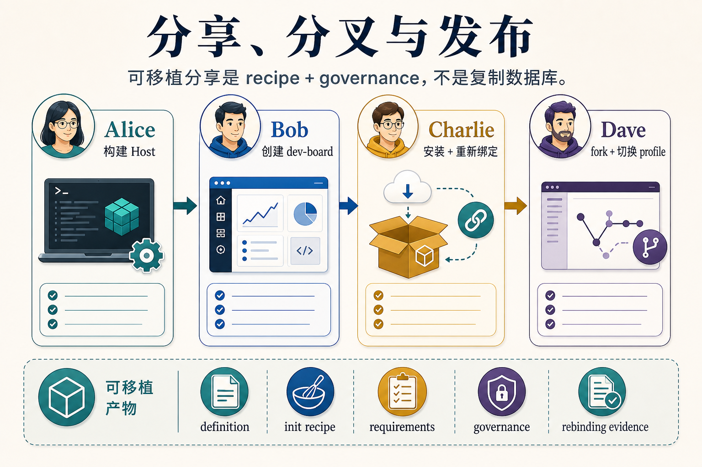

# 从这里开始：构建 Creation Host

**读者：** 正在评估或准备基于 `pneuma-framework` 构建产品的 Developer  
**状态：** RC 已接受，起始 tag 为 `pneuma-rc-0.1.0`；最新 developer-contract patch 为 `pneuma-rc-0.1.1`
**English version:** [start-here.md](./start-here.md)

如果你是第一次从外部进入 Pneuma，这应该是第一篇阅读文档。

最短且准确的描述是：

> `pneuma-framework` 是用于构建 **AI-native Creation Host** 的基础设施。Creation Host 让 Builder 通过和 Build-phase Agent 对话，创建、检查、演进、发布和运营 Generated Application。

这意味着你不是在直接构建一个 app。你是在构建一个能够让别人创造 app 的产品表面。

## 1. 产品模型


请始终显式保留这个模型：

```text
pneuma-framework
  -> Creation Host
  -> Generated Application
  -> Published Application
```

framework 是 primitive 层。Creation Host 是你面向 Builder 的产品。Generated Application 是 Builder 在 Host 里创造出来的 app。Published Application 是 End User 打开的活跃发布版本。

大多数设计错误都来自把这四层压缩成一个“app”。当文档里出现 “pneuma app” 时，先确认它指的是 Host、Generated Application，还是 Published Application。

## 2. Developer 到底构建什么


作为 Developer，你的主要工作是构建一个边界清晰的 Creation Host：

- Builder 可以选择哪些 profile 和技术栈；
- Host 提供什么 Build-phase Agent package 和 semantic tools；
- preview、inspection、publish、restart、rollback 如何工作；
- 支持哪些 provider capability，以及如何证明不同 provider 的语义一致；
- portable sharing、forking、credential rebinding 如何被治理。

framework 会验证共享契约，但不应该吞掉你的 Host 产品体验、provider 实现细节或领域模板逻辑。

## 3. Builder 如何创造 app


Builder 在你的 Creation Host 里工作：

1. Builder 描述想要的应用或变更。
2. Build-phase Agent 使用 framework semantic tools 把意图变成 proposal。
3. Host 展示 preview、schema/data inspection、transcript、impact 和 approval evidence。
4. 批准后的变更成为一个 Generated Application version。
5. Builder 可以发布这个版本，并把它作为 Published Application 运营。

关键 primitive 不是“Agent 改文件”。关键 primitive 是：用户动作、agent tool call、approval、evidence、runtime behavior 都能穿过同一条受治理的 framework 路径。

## 4. 为什么需要这些契约


framework 会对许多 Creation Host 都需要的契约保持主见：

- Operation 和 definition-as-data，用于治理 app 演进；
- Authorization Kernel、approval token、permission ledger 和 audit evidence；
- lifecycle semantic tools，而不是让 agent 直接碰脚本；
- release candidate、rollout 和 recovery evidence；
- Build Agent Package、provider matrix、share artifact、sharing governance、credential rebinding validation。

目标不是“无限抽象”。目标是让 Developer 能构建真实的 Host，而不必重新发明 agent loop、governance path、preview/publish loop 和 portability checks。

## 5. 分享和分叉如何保持可移植



当前 RC evidence 使用 Alice/Bob/Charlie/Dave 故事：

- Alice 基于 Pneuma 构建一个 Creation Host。
- Bob 用它创建 `dev-board`。
- Charlie 安装 Bob 分享的 artifact，并重新绑定自己的凭据。
- Dave fork 这个 artifact，选择不同 provider profile，移除某个能力，并发布自己的版本。

这就是为什么 share artifact 不应该包含源数据库和 secrets。可移植 artifact 携带的是 app definition、init recipe、provider requirements、governance 和 credential rebinding requirements。接收方 Builder 提供自己的凭据和目标 profile。

## 接下来读什么

建议按这个顺序阅读：

1. [Getting Started 中文版](./getting-started.zh-CN.md) — 跑通 scaffold、doctor 和 reference Host loops。
2. [Creation Host Contract 中文版](./creation-host-contract.zh-CN.md) — 理解最小 Host contract 和 authoring kit 文件。
3. [Release Candidate Snapshot 中文版](../architecture/release-candidate-snapshot.zh-CN.md) — 理解为什么 `pneuma-rc-0.1.0` 可以被接受。
4. [RC 0.1.1 Patch Snapshot 中文版](../architecture/release-candidate-0.1.1-snapshot.zh-CN.md) — 理解哪些 DevBoard feedback 被收进 developer-contract polish。
5. [升级到 RC 0.1.1](./upgrading-to-rc-0.1.1.zh-CN.md) — 更新已经使用 `pneuma-rc-0.1.0` 的下游 Host。
6. [AppConfig Authoring 中文版](./app-config-authoring.zh-CN.md)、[Runtime Composition 中文版](./runtime-composition.zh-CN.md)、[Release Rollout Authoring 中文版](./release-rollout-authoring.zh-CN.md) — 真正写 Host runtime 前先读。
7. [M25 Story Kit 中文版](../../examples/m25-alice-creation-host-prototype/STORY.zh-CN.md) — 用 Alice/Bob/Charlie/Dave 故事做团队解释。
8. [架构索引](../architecture/README.md) — 需要深入时再进入 ADR、milestone 和历史证据。

## 这个 RC 不声称什么

这个 RC 不是生产级 SaaS 平台。它不包含 hosted identity、credential broker、marketplace transport、完整云部署 adapter、Runtime Agent 产品表面、hot reload，也不包含完整的 Pneuma 2.x 重建。

它声称的是：核心模型已经足够自洽，Developer 可以开始构建 Creation Host，并用真实产品形态继续压力测试 framework contracts。
