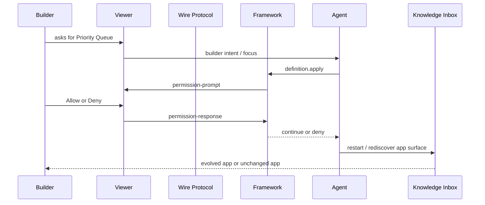

# M7 Live Agent Approval Protocol Implementation Plan

> **Superseded:** This was the first M7 plan. It proved live viewer permission response routing, but its approval unit was still a low-level `definition.apply` mutation. The revised M7 plan is [`2026-05-02-m7-capability-change-set-approval.md`](./2026-05-02-m7-capability-change-set-approval.md), which makes one Builder intent map to one `definition.apply_change_set` approval.

> **For agentic workers:** REQUIRED SUB-SKILL: Use superpowers:subagent-driven-development (recommended) or superpowers:executing-plans to implement this plan task-by-task. Steps use checkbox (`- [ ]`) syntax for tracking.

**Goal:** Turn M6's recorded real-agent evolution into a live Builder approval loop: the Build-phase Agent proposes a governed definition change, the Builder sees a human-readable approval card in the app, approves or denies it through the viewer protocol, and the app shows before state, agent work, approval decision, restart/reload continuity, and after state.

**Architecture:** M7 keeps `definition.apply` as the single governance entrypoint. The new work adds a durable execution transcript, a permission response observation hook in the framework orchestrator, a live approval scenario in the Knowledge Inbox viewer, and an M7 runner that can execute the same path with either a fake backend for deterministic tests or opencode for real-agent demonstrations. Viewer approval travels over the existing wire-protocol WebSocket; the app only renders protocol state and sends `permission-response`.

**Tech Stack:** Bun, TypeScript, existing pneuma packages, existing wire-protocol WebSocket, Knowledge Inbox vanilla viewer, SQLite/Drizzle app substrate from M3-M6, Vitest/Bun test runner, Chrome DevTools browser verification for the live demo.

---

## File Map

Create:

- `examples/m7-live-agent-approval-protocol/transcript.ts`
- `examples/m7-live-agent-approval-protocol/transcript.test.ts`
- `examples/m7-live-agent-approval-protocol/run.ts`
- `examples/m7-live-agent-approval-protocol/run.test.ts`
- `examples/m7-live-agent-approval-protocol/README.md`

Modify:

- `packages/core/src/lifecycle.ts`
- `packages/core/test/tools/definition-apply.test.ts`
- `templates/knowledge-inbox-core-domain/server/app.ts`
- `templates/knowledge-inbox-core-domain/viewer/index.html`
- `templates/knowledge-inbox-core-domain/test/viewer-contract.test.ts`
- `AGENTS.md`
- `docs/architecture/roadmap.md`
- `docs/architecture/OPEN-QUESTIONS.md` only if implementation discovers a real open question not covered by the current M7 design

Do not modify:

- M6 trace format in `examples/m6-real-agent-evolution/trace.ts`; M7 may read from or reuse helpers, but M6 evidence remains stable.
- Framework operation governance semantics in `packages/runtime/src/framework-operations.ts` unless a test proves the live approval path needs a contract fix.

---

## Task 1: Add A Durable Agent Execution Transcript

The transcript is a demo and debugging primitive. It must be stable enough for the viewer to render without understanding opencode-specific event chunks.

- [ ] Write failing tests first in `examples/m7-live-agent-approval-protocol/transcript.test.ts`.

Test cases:

```ts
import { describe, expect, test } from "bun:test";
import {
  appendTranscriptEvent,
  createAgentExecutionTranscript,
  recordApprovalResponse,
  recordAssistantTextDelta,
  recordCompletion,
  recordPermissionPrompt,
  recordToolCall,
  recordToolResult,
} from "./transcript";

describe("M7 agent execution transcript", () => {
  test("creates a transcript with a builder request and before/after slots", () => {
    const transcript = createAgentExecutionTranscript({
      runId: "m7-test",
      builderRequest: "Add a priority queue",
      before: { operations: [], views: [], tables: [] },
    });

    expect(transcript.schema_version).toBe(1);
    expect(transcript.run_id).toBe("m7-test");
    expect(transcript.builder_request).toBe("Add a priority queue");
    expect(transcript.before).toBeTruthy();
    expect(transcript.after).toBeNull();
    expect(transcript.events.map((event) => event.kind)).toEqual(["builder_message"]);
  });

  test("merges adjacent assistant text deltas into one assistant message", () => {
    const transcript = createAgentExecutionTranscript({
      runId: "m7-test",
      builderRequest: "Add a priority queue",
      before: { operations: [], views: [], tables: [] },
    });

    recordAssistantTextDelta(transcript, "I will add ");
    recordAssistantTextDelta(transcript, "a governed operation.");

    const assistantMessages = transcript.events.filter((event) => event.kind === "assistant_message");
    expect(assistantMessages).toHaveLength(1);
    expect(assistantMessages[0]?.summary).toBe("I will add a governed operation.");
  });

  test("correlates permission prompt, approval response, tool result, and completion", () => {
    const transcript = createAgentExecutionTranscript({
      runId: "m7-test",
      builderRequest: "Add a priority queue",
      before: { operations: [], views: [], tables: [] },
    });

    recordToolCall(transcript, {
      callId: "call-1",
      tool: "definition.apply",
      input: { changes: [{ kind: "add_operation", operation: "list_priority_queue" }] },
    });
    recordPermissionPrompt(transcript, {
      promptId: "prompt-1",
      tool: "definition.apply",
      detail: { change_count: 3 },
    });
    recordApprovalResponse(transcript, {
      promptId: "prompt-1",
      tool: "definition.apply",
      decision: "allow",
    });
    recordToolResult(transcript, {
      callId: "call-1",
      tool: "definition.apply",
      ok: true,
      result: { applied: true },
    });
    recordCompletion(transcript, {
      status: "completed",
      after: { operations: ["list_priority_queue"], views: ["priority_queue"], tables: [] },
      summary: "Priority Queue is live.",
    });

    expect(transcript.status).toBe("completed");
    expect(transcript.after).toEqual({
      operations: ["list_priority_queue"],
      views: ["priority_queue"],
      tables: [],
    });
    expect(transcript.events.map((event) => event.kind)).toEqual([
      "builder_message",
      "tool_call",
      "permission_prompt",
      "approval_response",
      "tool_result",
      "completion",
    ]);
  });
});
```

- [ ] Run the focused test and confirm it fails because the module does not exist.

Command:

```bash
bun test examples/m7-live-agent-approval-protocol/transcript.test.ts
```

Expected failure:

```text
Cannot find module './transcript'
```

- [ ] Implement `examples/m7-live-agent-approval-protocol/transcript.ts`.

Contract:

```ts
export type AgentExecutionStatus = "running" | "completed" | "denied" | "failed";

export type AgentExecutionEventKind =
  | "builder_message"
  | "assistant_message"
  | "tool_call"
  | "permission_prompt"
  | "approval_response"
  | "tool_result"
  | "framework_restart"
  | "completion";

export interface AgentExecutionEvent {
  id: string;
  at: string;
  actor: "builder" | "agent" | "framework";
  kind: AgentExecutionEventKind;
  tool?: string;
  prompt_id?: string;
  call_id?: string;
  decision?: "allow" | "deny" | "allow-always";
  ok?: boolean;
  summary: string;
  detail?: unknown;
}

export interface AgentExecutionTranscript {
  schema_version: 1;
  run_id: string;
  status: AgentExecutionStatus;
  builder_request: string;
  before: unknown;
  after: unknown | null;
  events: AgentExecutionEvent[];
}
```

Implementation rules:

- Use `crypto.randomUUID()` for event IDs.
- Store timestamps as ISO strings.
- `recordAssistantTextDelta` appends to the immediately previous `assistant_message` when that event has no `tool`, `prompt_id`, or `call_id`.
- `writeAgentExecutionTranscript(workspace, transcript)` writes `data/m7-agent-execution-transcript.json`.
- `readAgentExecutionTranscript(workspace)` returns `null` when the file does not exist.
- Summaries must be concise and renderable as primary text in the viewer.

- [ ] Run the focused transcript test and confirm it passes.

Command:

```bash
bun test examples/m7-live-agent-approval-protocol/transcript.test.ts
```

Expected:

```text
3 pass
```

- [ ] Commit Task 1.

Command:

```bash
git add examples/m7-live-agent-approval-protocol/transcript.ts examples/m7-live-agent-approval-protocol/transcript.test.ts
git commit -m "feat: add M7 transcript model"
```

---

## Task 2: Expose Permission Response Observation In The Framework Orchestrator

M7 needs to record the Builder's decision without making the Knowledge Inbox viewer call a custom M7-only HTTP endpoint. Approval remains wire-protocol state.

- [ ] Add failing framework test coverage in `packages/core/test/tools/definition-apply.test.ts`.

Add one test near the existing `definition.apply` approval tests:

```ts
test("definition.apply notifies permission response hook when a viewer answers a framework prompt", async () => {
  const observed: Array<{ id: string; tool: string; decision: "allow" | "deny" | "allow-always" }> = [];

  // Use the existing definition.apply approval fixture in this file.
  // Install the hook before invoking definition.apply.
  orchestrator.setPermissionResponseHook((event) => observed.push(event));

  const pending = executeDefinitionApplyWithApproval({
    changes: [{ kind: "add_table", id: "notes", name: "Notes" }],
  });

  const prompt = await nextFrameworkPermissionPrompt();
  expect(orchestrator.handleFrameworkPermissionResponse(prompt.id, "deny")).toBe(true);
  await expect(pending).resolves.toMatchObject({
    ok: false,
    state: { status: "denied" },
  });

  expect(observed).toEqual([
    { id: prompt.id, tool: "definition.apply", decision: "deny" },
  ]);
});
```

Adapt the helper names to the existing local helper functions in that test file; keep the asserted behavior exactly the same.

- [ ] Run the focused core test and confirm it fails on missing `setPermissionResponseHook`.

Command:

```bash
bun test packages/core/test/tools/definition-apply.test.ts
```

Expected failure:

```text
Property 'setPermissionResponseHook' does not exist
```

- [ ] Implement the hook in `packages/core/src/lifecycle.ts`.

Add:

```ts
export interface FrameworkPermissionResponseEvent {
  id: string;
  tool: string;
  decision: "allow" | "deny" | "allow-always";
}
```

Add to `LifecycleOrchestrator`:

```ts
private permissionResponseHook?: (event: FrameworkPermissionResponseEvent) => void;

setPermissionResponseHook(hook: ((event: FrameworkPermissionResponseEvent) => void) | undefined): void {
  this.permissionResponseHook = hook;
}
```

In `handleFrameworkPermissionResponse`, call the hook only when the response matches an active framework prompt and is recorded:

```ts
this.permissionResponseHook?.({
  id,
  tool: context.tool,
  decision,
});
```

Rules:

- Return `false` for unknown IDs exactly as today.
- Do not call the hook for unknown IDs.
- Preserve existing approval ledger behavior.
- Preserve existing deploy and rollback approval behavior. If those paths use separate prompt contexts, include the same hook call there with the real tool name.

- [ ] Run the focused core test.

Command:

```bash
bun test packages/core/test/tools/definition-apply.test.ts
```

Expected:

```text
pass
```

- [ ] Commit Task 2.

Command:

```bash
git add packages/core/src/lifecycle.ts packages/core/test/tools/definition-apply.test.ts
git commit -m "feat: expose framework permission response hook"
```

---

## Task 3: Add The M7 Live Approval Runner

The runner proves the backend-agent path can pause on a real permission prompt and resume after the viewer responds. It must also support deterministic allow/deny tests.

- [ ] Write failing runner tests in `examples/m7-live-agent-approval-protocol/run.test.ts`.

Test cases:

1. Fake backend with auto-allow produces:
   - transcript status `completed`
   - at least one `permission_prompt`
   - at least one `approval_response` with `decision: "allow"`
   - final Knowledge Inbox config includes `list_priority_queue`
   - Priority Queue API returns three rows

2. Fake backend with auto-deny produces:
   - transcript status `denied`
   - at least one `permission_prompt`
   - at least one `approval_response` with `decision: "deny"`
   - no `list_priority_queue` operation in final config
   - runner exits without hanging

3. The runner exposes the framework session:
   - `PNEUMA_SESSION_ID` is visible to the app through `/api/framework-session`
   - `PNEUMA_WS_URL` is visible to the app through `/api/framework-session`

- [ ] Run the focused runner tests and confirm they fail because `run.ts` does not exist.

Command:

```bash
bun test examples/m7-live-agent-approval-protocol/run.test.ts
```

Expected failure:

```text
Cannot find module './run'
```

- [ ] Implement `examples/m7-live-agent-approval-protocol/run.ts`.

Runner contract:

```bash
bun run examples/m7-live-agent-approval-protocol/run.ts \
  --backend fake \
  --auto-decision none \
  --port 8878
```

Supported flags:

- `--backend fake|opencode`; default `fake`
- `--auto-decision allow|deny|none`; default `none`
- `--port <number>`; default `8878`
- `--workspace <path>`; default temporary workspace under `examples/m7-live-agent-approval-protocol/.tmp`
- `--smoke-exit`; exits after completion or denial, used by tests

Implementation structure:

```ts
export interface M7RunArgs {
  backend: "fake" | "opencode";
  autoDecision: "allow" | "deny" | "none";
  port: number;
  workspace: string;
  smokeExit: boolean;
}

export async function runM7LiveApproval(args: M7RunArgs): Promise<M7RunResult> {
  // 1. Create before snapshot from Knowledge Inbox config.
  // 2. Create transcript.
  // 3. Create framework with wire enabled.
  // 4. Install prompt hook that records prompt and broadcasts it.
  // 5. Install response hook that records Builder approval response.
  // 6. Start Knowledge Inbox dev lifecycle.
  // 7. Run fake backend or opencode backend.
  // 8. On allow, wait for restart/API rediscovery and record completion.
  // 9. On deny, record denied completion and leave app unchanged.
}
```

Prompt hook behavior:

```ts
framework.orchestrator.setPermissionPromptPushHook((env) => {
  recordPermissionPrompt(transcript, {
    promptId: env.prompt.id,
    tool: env.prompt.tool,
    detail: env.prompt.detail,
  });
  writeAgentExecutionTranscript(args.workspace, transcript);
  framework.wireServer?.broadcast(framework.sessionId!, env);

  if (args.autoDecision !== "none") {
    queueMicrotask(() => {
      framework.orchestrator.handleFrameworkPermissionResponse(env.prompt.id, args.autoDecision);
    });
  }
});
```

Response hook behavior:

```ts
framework.orchestrator.setPermissionResponseHook((event) => {
  recordApprovalResponse(transcript, {
    promptId: event.id,
    tool: event.tool,
    decision: event.decision,
  });
  writeAgentExecutionTranscript(args.workspace, transcript);
});
```

Use M6 code where useful:

- Reuse the Priority Queue definition changes from `examples/m6-real-agent-evolution/run.ts`.
- Reuse the before/after summary shape from `examples/m6-real-agent-evolution/trace.ts` where possible.
- Keep M7 transcript separate from M6 trace.

- [ ] Run the focused runner tests and confirm they pass.

Command:

```bash
bun test examples/m7-live-agent-approval-protocol/run.test.ts
```

Expected:

```text
3 pass
```

- [ ] Commit Task 3.

Command:

```bash
git add examples/m7-live-agent-approval-protocol/run.ts examples/m7-live-agent-approval-protocol/run.test.ts
git commit -m "feat: add M7 live approval runner"
```

---

## Task 4: Add Knowledge Inbox Live Approval UI

The app should make the primitive understandable to a zero-prep teammate: left side is the app/data/API outcome, right side is the Builder-agent process with a real approval card.

- [ ] Add failing static viewer contract tests in `templates/knowledge-inbox-core-domain/test/viewer-contract.test.ts`.

Assertions:

- `scenario === "live-approval"` is recognized.
- Viewer fetches `/api/agent-execution-transcript`.
- Viewer fetches `/api/framework-session`.
- Viewer opens a WebSocket using the framework session.
- Viewer sends `permission-response`.
- Viewer renders:
  - `data-testid="live-approval-card"`
  - `data-testid="allow-live-approval"`
  - `data-testid="deny-live-approval"`
  - `data-testid="agent-transcript-drawer"`
  - text `Live Builder approval`
  - text `Before`
  - text `After`

- [ ] Run the focused viewer contract test and confirm it fails.

Command:

```bash
bun test templates/knowledge-inbox-core-domain/test/viewer-contract.test.ts
```

Expected failure:

```text
expected viewer HTML to contain live approval contract strings
```

- [ ] Update `templates/knowledge-inbox-core-domain/server/app.ts`.

Add:

```ts
app.get("/api/framework-session", (c) => {
  const sessionId = process.env.PNEUMA_SESSION_ID ?? null;
  const wsUrl = process.env.PNEUMA_WS_URL ?? null;
  return c.json({
    ok: Boolean(sessionId && wsUrl),
    session_id: sessionId,
    ws_url: wsUrl,
  });
});
```

Add:

```ts
app.get("/api/agent-execution-transcript", async (c) => {
  const workspace = process.env.PNEUMA_WORKSPACE;
  if (!workspace) {
    return c.json({ ok: false, transcript: null, error: "PNEUMA_WORKSPACE is not set" }, 200);
  }
  const transcript = await readJsonIfExists(path.join(workspace, "data", "m7-agent-execution-transcript.json"));
  return c.json({ ok: true, transcript });
});
```

Reuse the local JSON-read helper style already used by `/api/evolution-trace`.

- [ ] Update `templates/knowledge-inbox-core-domain/viewer/index.html`.

Scenario:

```js
const isLiveApprovalScenario = scenario === "live-approval";
const isEvolutionScenario = isBuilderEvolution || isRealAgentEvolution || isLiveApprovalScenario;
```

State additions:

```js
state.agentTranscript = null;
state.frameworkSession = null;
state.frameworkSocket = null;
state.pendingApproval = null;
state.approvalStatus = "idle";
```

Fetch additions:

```js
async function loadFrameworkSession() { ... }
async function loadAgentExecutionTranscript() { ... }
```

WebSocket connection:

```js
function connectFrameworkSocket() {
  if (!state.frameworkSession?.ok || state.frameworkSocket) return;
  const base = state.frameworkSession.ws_url.replace(/^http/, "ws");
  const socket = new WebSocket(`${base}/ws/viewer/${state.frameworkSession.session_id}`);
  socket.addEventListener("message", (event) => {
    const envelope = JSON.parse(event.data);
    if (envelope.kind === "permission-prompt") {
      state.pendingApproval = envelope.prompt;
      state.approvalStatus = "pending";
      render();
    }
  });
  state.frameworkSocket = socket;
}
```

Approval sender:

```js
function sendLiveApproval(decision) {
  if (!state.frameworkSocket || !state.pendingApproval) return;
  state.frameworkSocket.send(JSON.stringify({
    dir: "v2a",
    kind: "permission-response",
    response: {
      id: state.pendingApproval.id,
      decision,
    },
  }));
  state.approvalStatus = decision;
  state.pendingApproval = null;
  render();
}
```

Render requirements:

- Approval card is visible when `state.pendingApproval` exists.
- Card shows tool name, change count, affected operations/views/tables when present in `detail`.
- Allow button calls `sendLiveApproval("allow")`.
- Deny button calls `sendLiveApproval("deny")`.
- Transcript drawer groups events by actor and renders tool calls distinctly from text messages.
- Main interface shows `Before` and `After` snapshots from transcript when available; otherwise it falls back to the existing app/data/API panels.

- [ ] Run the viewer contract test.

Command:

```bash
bun test templates/knowledge-inbox-core-domain/test/viewer-contract.test.ts
```

Expected:

```text
pass
```

- [ ] Commit Task 4.

Command:

```bash
git add templates/knowledge-inbox-core-domain/server/app.ts templates/knowledge-inbox-core-domain/viewer/index.html templates/knowledge-inbox-core-domain/test/viewer-contract.test.ts
git commit -m "feat: add Knowledge Inbox live approval UI"
```

---

## Task 5: Prove The Live Approval Loop End To End

This is the milestone gate. Do not write the M7 snapshot until this task is green.

- [ ] Run targeted tests.

Command:

```bash
bun test \
  examples/m7-live-agent-approval-protocol/transcript.test.ts \
  examples/m7-live-agent-approval-protocol/run.test.ts \
  packages/core/test/tools/definition-apply.test.ts \
  templates/knowledge-inbox-core-domain/test/viewer-contract.test.ts
```

Expected:

```text
pass
```

- [ ] Run full repo verification that has been used in prior milestone gates.

Commands:

```bash
bun test
bun run typecheck
git diff --check
```

Expected:

```text
All tests pass
Typecheck exits 0
git diff --check exits 0
```

- [ ] Start the deterministic live approval demo.

Command:

```bash
bun run examples/m7-live-agent-approval-protocol/run.ts \
  --backend fake \
  --auto-decision none \
  --port 8878
```

Expected terminal state:

```text
Knowledge Inbox live approval demo: http://127.0.0.1:8878/?scenario=live-approval
Waiting for Builder approval
```

- [ ] Verify the allow path in the in-app browser.

Browser URL:

```text
http://127.0.0.1:8878/?scenario=live-approval
```

Manual checks:

- The page renders the Knowledge Inbox app surface, not a wireframe.
- Right-side Builder/Agent pane shows the builder request.
- Approval card appears with `definition.apply`.
- Click `Allow`.
- The app resumes and shows Priority Queue.
- Data view shows priority values for the demo rows.
- API/domain layer shows `list_priority_queue`.
- Transcript drawer shows builder message, assistant text, tool call, permission prompt, approval response, tool result, restart/reload event, and completion.
- `/api/agent-execution-transcript` returns `status: "completed"`.

- [ ] Verify the deny path in the in-app browser.

Restart the demo:

```bash
bun run examples/m7-live-agent-approval-protocol/run.ts \
  --backend fake \
  --auto-decision none \
  --port 8879
```

Browser URL:

```text
http://127.0.0.1:8879/?scenario=live-approval
```

Manual checks:

- Approval card appears with `definition.apply`.
- Click `Deny`.
- The app stays in the original Knowledge Inbox shape.
- Priority Queue does not appear.
- Transcript drawer shows the denial and a denied completion.
- `/api/agent-execution-transcript` returns `status: "denied"`.

- [ ] Capture demo evidence.

Save screenshots to:

- `docs/architecture/assets/m7-live-approval-before.png`
- `docs/architecture/assets/m7-live-approval-prompt.png`
- `docs/architecture/assets/m7-live-approval-after.png`
- `docs/architecture/assets/m7-live-approval-transcript.png`

Use the Chrome DevTools screenshot tool or the existing browser QA workflow. Keep file names stable so the snapshot can reference them.

---

## Task 6: M7 Documentation And Milestone Snapshot

Only do this after Task 5 passes.

- [ ] Add `examples/m7-live-agent-approval-protocol/README.md`.

Content:

- What M7 proves
- How to run the fake-backend live approval demo
- How to run the opencode-backed demo
- What the transcript file contains
- How approval travels through the wire protocol
- Known limitation: this is a dev-mode Builder approval loop, not production IAM

- [ ] Update `AGENTS.md`.

Status:

```md
- **Phase:** M7 closing — live Builder approval protocol.
```

Next step:

```md
See `docs/archive/milestone-7-snapshot.md` after the M7 gate closes.
```

Do not remove M6 context; keep it as closed milestone history.

- [ ] Update `docs/architecture/roadmap.md`.

Add M7 as:

```md
### M7 — Live Agent Approval Protocol

Status: Closed after live-browser allow/deny verification.
Evidence: deterministic runner, transcript endpoint, viewer approval card, wire-protocol response, screenshots.
```

- [ ] Create `docs/archive/milestone-7-snapshot.md`.

Required sections:

- Executive summary
- What changed from M6
- The full M7 story in one diagram
- What the Builder sees
- What the framework guarantees
- What the transcript proves
- Verification report
- Screenshots
- Remaining risks
- Recommended M8 options

Include a Mermaid diagram:



- [ ] Run documentation checks.

Commands:

```bash
rg "M7|live approval|permission-response" docs/architecture AGENTS.md examples/m7-live-agent-approval-protocol
git diff --check
```

Expected:

```text
rg returns M7 references in snapshot, roadmap, AGENTS, and example README
git diff --check exits 0
```

- [ ] Commit documentation.

Command:

```bash
git add \
  AGENTS.md \
  docs/architecture/roadmap.md \
  docs/archive/milestone-7-snapshot.md \
  docs/architecture/assets/m7-live-approval-before.png \
  docs/architecture/assets/m7-live-approval-prompt.png \
  docs/architecture/assets/m7-live-approval-after.png \
  docs/architecture/assets/m7-live-approval-transcript.png \
  examples/m7-live-agent-approval-protocol/README.md
git commit -m "docs: close M7 live approval protocol"
```

---

## Final Review Checklist

- [ ] `definition.apply` remains the only app-definition mutation path used by the M7 demo.
- [ ] Raw framework operations are not exposed to the agent as a bypass.
- [ ] Viewer approval uses existing wire protocol, not an example-only private endpoint.
- [ ] Deny path is as visible and tested as allow path.
- [ ] Transcript contains human-readable assistant/tool/approval/restart/completion events.
- [ ] M6 trace remains readable and unchanged.
- [ ] M7 snapshot explains why this matters from a zero-prep teammate's perspective.
- [ ] No production IAM claim is made; this is Builder approval in dev-mode.

---

## Suggested M8 Branches After M7

M8 should be chosen after the M7 team review, not before. Plausible next branches:

1. **Real opencode interactive approval:** replace fake live approval with real opencode pause/resume and richer tool-call streaming.
2. **Release packaging hardening:** make the evolved Knowledge Inbox package cleanly into Docker with persistent SQLite volume and a release manifest.
3. **Semantic index return:** add Qdrant-compatible semantic retrieval as an app capability, not as framework semantics.
4. **Protocol SDK polish:** graduate the live approval viewer behavior into reusable React/Vanilla SDK helpers.
