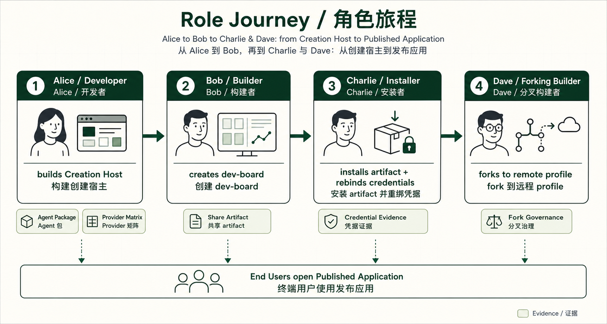
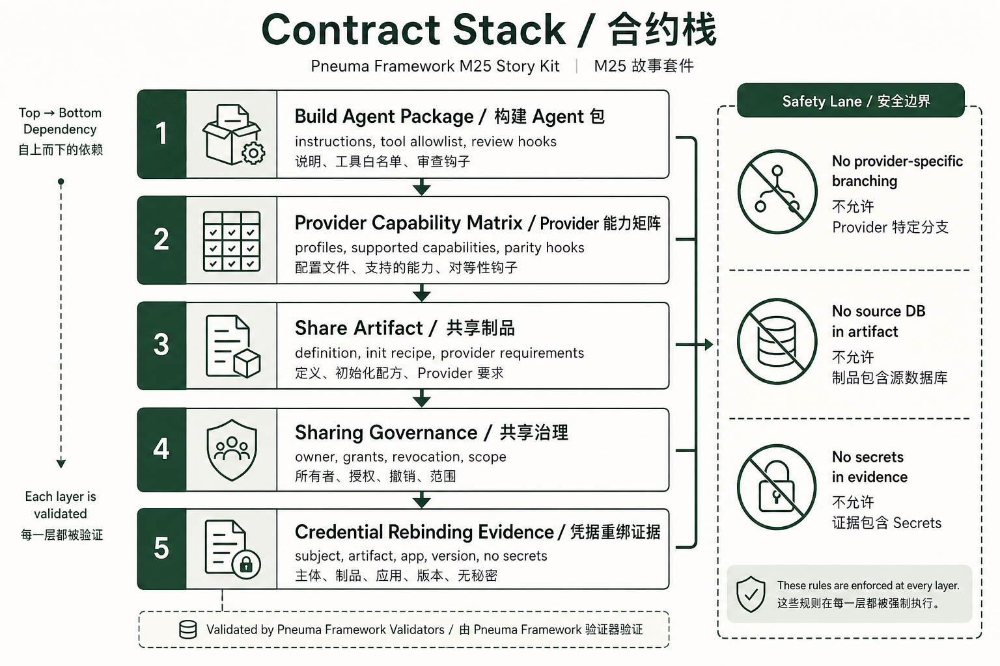
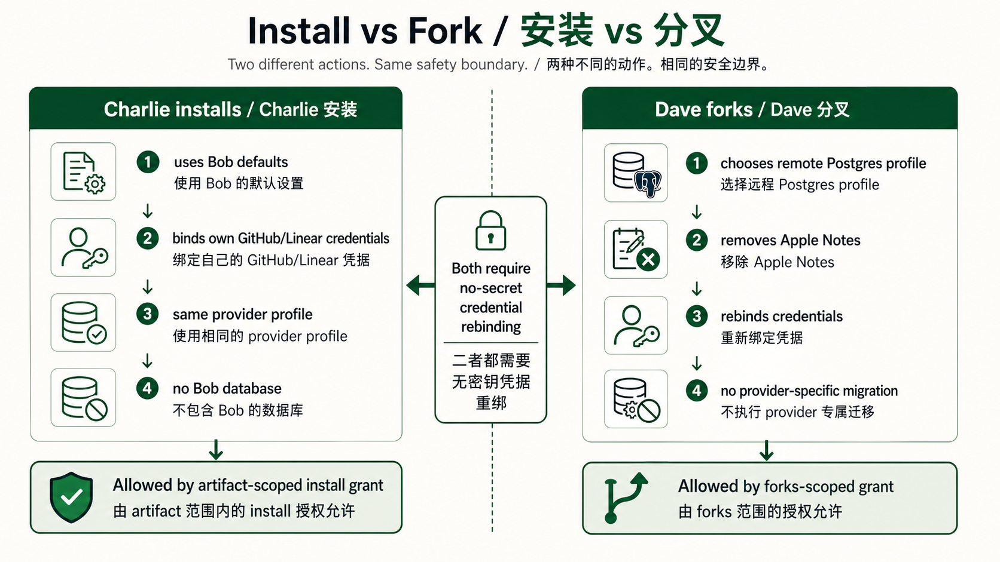

# M25 Story Kit: Alice Builds a Creation Host

**Audience:** a Developer or teammate with zero Pneuma history.

**Purpose:** explain why `pneuma-framework` exists by walking through Alice's mental path before showing Bob/Charlie/Dave outcomes.

**Runnable prototype:** [README.md](./README.md)

**Chinese version:** [STORY.zh-CN.md](./STORY.zh-CN.md)

## Story Promise

M25 should leave the audience with one sentence:

```text
pneuma-framework helps Alice build a Creation Host, so Bob can create Generated Applications through an agent, and Charlie/Dave can install or fork those apps without copying databases or secrets.
```

This story is not "Alice writes an app." It is "Alice writes the app builder product surface."

## Visual Map

| Visual | Question it answers | Asset |
|---|---|---|
| Product layers | What are Alice, Bob, and End Users each touching? | [m25-story-product-model.png](../../docs/architecture/assets/m25-story-product-model.png) |
| Role journey | How does the story move from Alice to Bob to Charlie/Dave? | [m25-story-role-journey.png](../../docs/architecture/assets/m25-story-role-journey.png) |
| Contract stack | Which framework contracts make the story safe? | [m25-story-contract-stack.png](../../docs/architecture/assets/m25-story-contract-stack.png) |
| Install vs fork | Why is Charlie install different from Dave fork? | [m25-story-install-vs-fork.png](../../docs/architecture/assets/m25-story-install-vs-fork.png) |








## Cast

| Person | Role in the domain model | What they need |
|---|---|---|
| Alice | Developer | A framework contract for building a Creation Host, not a one-off app. |
| Bob | Builder | A Build-phase Agent prepared by Alice, plus preview/inspect/publish controls. |
| Charlie | Installer / Builder | Bob's default artifact, but with Charlie's own provider credentials. |
| Dave | Forking Builder | A forked app that switches provider profile and removes unsupported capabilities. |
| End User | Published Application user | A release-mode app surface; may never see the Build-phase Agent. |

## The Narrative Arc

### Act 1 — Name the product layer

Alice first asks: "Am I building an app, or an app builder?"

The answer is the project's core boundary:

```text
pneuma-framework
  -> Creation Host
  -> Generated Application
  -> Published Application
```

Alice builds the Creation Host. Bob creates `dev-board` through that Host. End Users open the Published Application. If this distinction is lost, every later governance, sharing, and provider decision becomes blurry.

### Act 2 — Decide what freedom means

Bob should not ask an unconstrained agent to invent the architecture. Alice decides which profiles the Creation Host exposes:

```text
local-sqlite-docker
remote-postgres-docker
```

The framework does not say SQLite or Postgres is the semantic truth. The Host says both profiles implement the same capability contract where required.

### Act 3 — Package the Build-phase Agent

Bob's agent is not a raw coding agent with unlimited context. Alice prepares a Build Agent Package:

```text
instructions
tool allowlist
provider-specialization policy
credential boundary
review checklist
verification hooks
```

The crucial rule is:

```text
Agent sees capability contracts, not provider implementation branches.
```

### Act 4 — Build Bob's dev-board

Bob asks for a daily development board that combines:

```text
GitHub issues / PRs
Linear project work
GitHub CI attention
Apple Notes context
```

The generated app is versioned as `dev-board@v3`. It has its own definition, data, versions, and release history. It is not Alice's Creation Host.

### Act 5 — Share without copying the world

Bob shares a portable artifact:

```text
included:
  app definition
  idempotent semantic init recipe
  provider requirements

excluded:
  source database
  secrets
  private derived cache
```

Charlie can install the default artifact, but he must rebind his own GitHub and Linear credentials. This is credential rebinding, not credential transfer.

### Act 6 — Fork with provider change

Dave wants a remote Linux/cloud path. He forks and switches to `remote-postgres-docker`.

This is allowed only if:

```text
fork grant scope is forks
credential evidence is version-bound
remote profile supports required capabilities
unsupported Apple Notes is removed
provider-specific migration is not used by the Builder agent
```

Dave's fork proves portability is semantic re-materialization through Host contracts, not raw database migration by an agent.

## Contract And Evidence Map

| Stage | Contract | Evidence in prototype | Failure probe |
|---|---|---|---|
| Product layer | Creation Host model | `artifact-model-boundary` | Collapse framework/Host/app into one "pneuma app" |
| Agent package | `BuildAgentPackageManifest` | `agent-package-valid` | Raw provider implementation leakage |
| Provider profiles | `ProviderCapabilityMatrix` | `provider-matrix-valid`, `provider-parity-present` | Missing parity hook |
| Credential boundary | `CredentialRequirement`, `CredentialRebindingEvidence` | `credential-boundary-no-secret`, `credential-evidence-version-bound` | Secret in artifact/evidence, stale version evidence |
| Portable sharing | `ShareArtifactManifest` | `share-artifact-valid`, `share-artifact-no-source-db` | Source DB or private cache included |
| Governance | `SharingGovernanceManifest` | `charlie-install-allowed`, `dave-fork-allowed` | Wrong grant scope |
| Fork compatibility | Provider matrix + fork plan | `apple-notes-local-only`, `provider-specific-migration-blocked` | Apple Notes leakage, provider-specific migration |
| RC judgment | M24 pressure evaluator | `rc-pressure-passed`, `productization-gaps-explicit` | Production gaps hidden as if solved |

## Demo Runbook

1. Open the prototype.
2. Start at stage 1 and read Alice's question out loud.
3. Click through the stages without jumping to the generated app preview first.
4. At stage 3, pause on the Build Agent Package. The important point is "Alice prepares Bob's agent."
5. At stage 4, pause on provider profiles. The important point is "provider compatibility belongs to Alice's Host contract."
6. At stage 7, explain that sharing is a recipe, not Bob's database.
7. At stage 8 and 9, compare Charlie install and Dave fork.
8. End on stage 10: M25 supports RC review, not production marketplace readiness.

## What This Story Keeps Honest

- The framework is not a specific app.
- The Creation Host is not a marketplace.
- Generated Application data is not the share artifact.
- Provider portability is not agent-authored migration.
- Credential rebinding evidence is not a secret container.
- RC readiness is not production readiness.

## What Comes After This Story

The story is ready for candidate-release review. After RC, the next productization lanes can be chosen explicitly:

- real credential broker;
- OAuth/account binding;
- signed artifacts;
- install/fork governance UI;
- real Postgres adapter;
- team/org admin workflows;
- marketplace/share transport.
